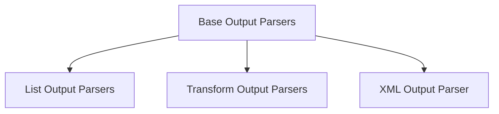

# Core Output Parsers

The `core_output_parsers` module in LangChain Core is responsible for structuring and interpreting the raw text outputs generated by language models (LLMs). It provides a flexible framework for converting unstructured LLM responses into various structured data formats, making it easier to integrate LLM capabilities into applications.

## Architecture Overview

The module is designed with a layered architecture, starting from abstract base classes that define common parsing interfaces, and extending to concrete implementations for specific output formats like lists and XML. It also includes components for handling streaming outputs and cumulative transformations.

<!-- DIAGRAM_JSON
{
    "direction": "TD",
    "nodes": [
        {"id": "base_parsers", "label": "Base Output Parsers", "type": "module", "link": "base_parsers.md"},
        {"id": "list_parsers", "label": "List Output Parsers", "type": "module", "link": "list_parsers.md"},
        {"id": "transform_parsers", "label": "Transform Output Parsers", "type": "module", "link": "transform_parsers.md"},
        {"id": "xml_parser", "label": "XML Output Parser", "type": "module", "link": "xml_parser.md"}
    ],
    "edges": [
        {"source": "base_parsers", "target": "list_parsers"},
        {"source": "base_parsers", "target": "transform_parsers"},
        {"source": "base_parsers", "target": "xml_parser"}
    ],
    "groups": []
}
-->

## Sub-modules

### [Base Output Parsers](base_parsers.md)
This sub-module defines the fundamental interfaces for all output parsers, handling basic parsing logic and serialization.

### [List Output Parsers](list_parsers.md)
This sub-module provides specialized parsers for various list formats, including comma-separated, numbered, and Markdown lists.

### [Transform Output Parsers](transform_parsers.md)
This sub-module manages streaming input and output transformations, including cumulative parsing and diff generation.

### [XML Output Parser](xml_parser.md)
This sub-module handles the parsing of XML formatted output, converting it into structured dictionary representations.