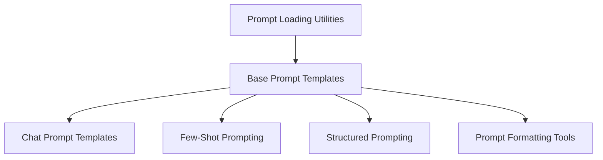

# `core_prompts` Module Documentation

## Introduction

The `core_prompts` module provides a robust and flexible framework for constructing, managing, and formatting prompts for language models. It encompasses a variety of prompt types, from basic string templates to sophisticated few-shot and structured prompts, enabling developers to precisely control how models interact with inputs and generate outputs.

## Architecture

The `core_prompts` module is designed with a clear separation of concerns, built upon a base prompt template that extends to specialized implementations for chat, few-shot, and structured prompting. Utility sub-modules handle aspects like prompt loading from configurations and various string formatting options.

<!-- DIAGRAM_JSON
{
    "direction": "TD",
    "nodes": [
        {"id": "prompt_templates_base", "label": "Base Prompt Templates", "type": "module", "link": "prompt_templates_base.md"},
        {"id": "chat_prompt_templates", "label": "Chat Prompt Templates", "type": "module", "link": "chat_prompt_templates.md"},
        {"id": "few_shot_prompts", "label": "Few-Shot Prompting", "type": "module", "link": "few_shot_prompts.md"},
        {"id": "structured_prompts", "label": "Structured Prompting", "type": "module", "link": "structured_prompts.md"},
        {"id": "prompt_loading", "label": "Prompt Loading Utilities", "type": "module", "link": "prompt_loading.md"},
        {"id": "prompt_formatters", "label": "Prompt Formatting Tools", "type": "module", "link": "prompt_formatters.md"}
    ],
    "edges": [
        {"source": "prompt_templates_base", "target": "chat_prompt_templates"},
        {"source": "prompt_templates_base", "target": "few_shot_prompts"},
        {"source": "prompt_templates_base", "target": "structured_prompts"},
        {"source": "prompt_loading", "target": "prompt_templates_base"},
        {"source": "prompt_templates_base", "target": "prompt_formatters"}
    ],
    "groups": []
}
-->

## Sub-modules

This module is organized into the following sub-modules, each addressing a specific aspect of prompt management:

*   ### [Base Prompt Templates](prompt_templates_base.md)
    Provides the foundational classes for all prompt templates, defining common interfaces and functionalities.

*   ### [Chat Prompt Templates](chat_prompt_templates.md)
    Handles the creation and formatting of various chat message types, including AI, system, and general chat messages.

*   ### [Few-Shot Prompting](few_shot_prompts.md)
    Manages the integration of few-shot examples into prompts, supporting both fixed and dynamically selected examples for enhanced model performance.

*   ### [Structured Prompting](structured_prompts.md)
    Facilitates the creation of prompts designed for structured output, enabling models to generate responses adhering to a defined schema.

*   ### [Prompt Loading Utilities](prompt_loading.md)
    Provides functions for loading prompt templates from various configurations and file formats.

*   ### [Prompt Formatting Tools](prompt_formatters.md)
    Includes utility functions for formatting prompt strings using different templating engines like Jinja2 and Mustache.
