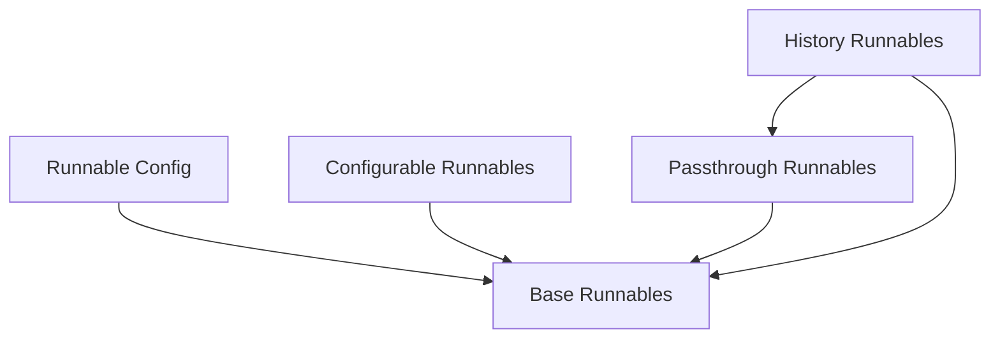

The `core_runnables` module is the foundational package for the LangChain Expression Language (LCEL). It provides the core abstractions and utilities for creating, composing, and executing modular units of work called 'Runnables'. These runnables enable developers to build complex chains and agents with capabilities like streaming, batching, asynchronous execution, and dynamic configuration, forming the backbone of flexible and scalable AI applications.

### Architecture
The `core_runnables` module is structured around a set of core abstract base classes and their specialized implementations, facilitating composable and configurable workflows.

### Core Components Documentation

The `core_runnables` module is composed of the following key sub-modules:

*   **[Base Runnables](base_runnables.md)**: Defines the fundamental `Runnable` interface and `RunnableSerializable` for creating composable and serializable units of work.
*   **[`runnable_config`](runnable_config.md)**: Provides utilities for managing runnable configuration, including exception handling wrappers.
*   **[configurable_runnables](configurable_runnables.md)**: Introduces `DynamicRunnable` for creating runnables whose behavior can be dynamically altered based on configuration.
*   **[`history_runnables`](history_runnables.md)**: Offers `RunnableWithMessageHistory` for integrating chat message history into any runnable, enabling stateful conversational agents.
*   **[`passthrough_runnables`](passthrough_runnables.md)**: Contains `RunnablePassthrough`, a flexible runnable for passing inputs unchanged or augmenting them with new keys.