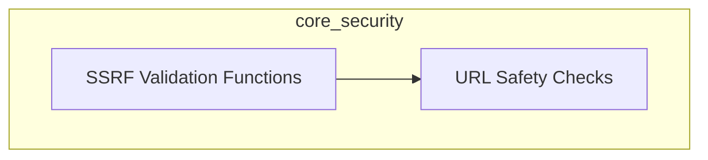

# Core Security Module Documentation

## Introduction

The `core_security` module is dedicated to enhancing the security posture of the system, primarily focusing on protection against Server-Side Request Forgery (SSRF) vulnerabilities. It provides a set of utilities and validation functions to ensure that URLs processed by the application are safe and do not lead to unintended access to internal resources or other malicious activities.

## Architecture Overview

The `core_security` module is structured around specialized functions that perform URL validation and safety checks. It is designed to be a foundational layer, providing critical security checks that other modules can integrate to prevent common web vulnerabilities.

<!-- DIAGRAM_JSON
{
    "direction": "TD",
    "nodes": [
        {"id": "url_safety_checks", "label": "URL Safety Checks", "type": "module", "link": "url_safety_checks.md"},
        {"id": "ssrf_validation_functions", "label": "SSRF Validation Functions", "type": "module", "link": "ssrf_validation_functions.md"}
    ],
    "edges": [
        {"source": "ssrf_validation_functions", "target": "url_safety_checks"}
    ],
    "groups": []
}
-->

## Sub-modules

### [URL Safety Checks](url_safety_checks.md)
This sub-module provides utilities for basic URL safety checks, determining if a given URL is safe based on specified criteria like allowing private IPs or HTTP.

### [SSRF Validation Functions](ssrf_validation_functions.md)
This sub-module contains specialized functions for validating URLs specifically against SSRF vulnerabilities, offering different modes of strictness including strict, HTTPS-only, and relaxed validation. It serves as the core defense mechanism against unauthorized internal network access via URL manipulation.
