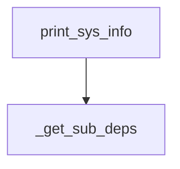

# `core_sys_info` Module Documentation

## Introduction
The `core_sys_info` module provides utilities for gathering and displaying system and package-related information. It is primarily used for debugging and environment introspection, allowing developers to quickly understand the setup in which their applications are running.

## Architecture and Component Relationships

The `core_sys_info` module contains a single primary function, `print_sys_info`, which serves as the main entry point for retrieving and displaying system information. This function internally utilizes a helper function, `_get_sub_deps`, to gather sub-dependency information for installed packages.

<!-- DIAGRAM_JSON
{
    "direction": "TD",
    "nodes": [
        {"id": "print_sys_info", "label": "print_sys_info", "type": "component", "link": null},
        {"id": "_get_sub_deps", "label": "_get_sub_deps", "type": "component", "link": null}
    ],
    "edges": [
        {"source": "print_sys_info", "target": "_get_sub_deps"}
    ],
    "groups": []
}
-->

### Components

#### `print_sys_info`
This is the main public function of the `core_sys_info` module. It performs the following actions:
- **System Information Gathering**: Collects and prints details about the operating system (OS, OS Version) and the Python environment (Python Version).
- **Package Discovery**: Identifies and lists all installed packages that start with "langchain" or "langgraph", along with a predefined set of other LangChain-related packages and any additional packages specified by the user.
- **Version Retrieval**: For each discovered package, it attempts to retrieve and display its installed version.
- **Handling Missing Packages**: Identifies and lists any specified packages that are not currently installed.
- **Sub-dependency Listing**: Calls the internal `_get_sub_deps` function to retrieve and display versions of identified sub-dependencies.

#### `_get_sub_deps`
This is an internal helper function used by `print_sys_info` to determine the sub-dependencies of the installed packages. It takes a list of package names as input and returns a list of their dependencies. The exact implementation details are internal to the module, but its role is to enrich the system information output with a deeper view of the package ecosystem.

## How the Module Fits into the Overall System
The `core_sys_info` module plays a crucial role in the overall system by providing a standardized and easy way to diagnose environment-related issues. It does not directly interact with core functionalities like agent execution or data processing but serves as a foundational utility for debugging, support, and development. By offering a comprehensive overview of the system and installed package versions, it helps in:
- **Troubleshooting**: Quickly identifying discrepancies in development or deployment environments.
- **Support**: Providing essential information when reporting issues or seeking help.
- **Development**: Ensuring that necessary dependencies are correctly installed and versioned.

This module is a standalone utility that can be invoked independently to gather system insights without affecting the runtime of other modules.
