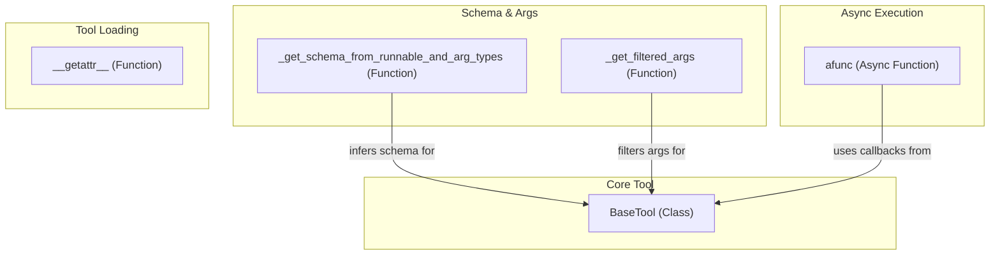

# core_tool_definitions
This module defines the foundational `BaseTool` class and provides utilities for tool schema inference, argument filtering, and asynchronous execution logic. It also includes a module-level `__getattr__` for handling tool imports and deprecation warnings.

<!-- DIAGRAM_JSON
{
  "nodes": [
    {"id": "BaseTool", "label": "BaseTool", "type": "class"},
    {"id": "_get_filtered_args", "label": "_get_filtered_args", "type": "function"},
    {"id": "_get_schema_from_runnable_and_arg_types", "label": "_get_schema_from_runnable_and_arg_types", "type": "function"},
    {"id": "afunc", "label": "afunc", "type": "async_function"},
    {"id": "__getattr__", "label": "__getattr__", "type": "function"}
  ],
  "edges": [
    {"source": "_get_schema_from_runnable_and_arg_types", "target": "BaseTool", "label": "infers schema for"},
    {"source": "_get_filtered_args", "target": "BaseTool", "label": "filters args for"},
    {"source": "afunc", "target": "BaseTool", "label": "uses callbacks from"}
  ],
  "groups": [
    {"id": "Core Tool", "label": "Core Tool", "nodes": ["BaseTool"]},
    {"id": "Schema & Args", "label": "Schema & Args", "nodes": ["_get_filtered_args", "_get_schema_from_runnable_and_arg_types"]},
    {"id": "Async Execution", "label": "Async Execution", "nodes": ["afunc"]},
    {"id": "Tool Loading", "label": "Tool Loading", "nodes": ["__getattr__"]}
  ]
}
-->
