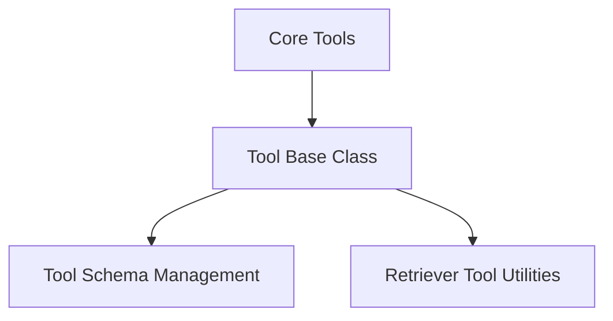

# Core Tools Module Documentation

## Introduction

The `core_tools` module provides the foundational components for defining, managing, and executing tools within the LangChain framework. These tools are essential for agents to interact with external systems, perform specific actions, and extend their capabilities. This module establishes the base structure and common utilities required for all LangChain tools.

## Architecture Overview

The `core_tools` module is structured into several sub-modules, each responsible for a distinct aspect of tool functionality, including the base definition, schema management, and specialized utilities.

<!-- DIAGRAM_JSON
{
    "direction": "TD",
    "nodes": [
        {"id": "tool_base", "label": "Tool Base Class", "type": "module", "link": "tool_base.md"},
        {"id": "tool_schema_management", "label": "Tool Schema Management", "type": "module", "link": "tool_schema_management.md"},
        {"id": "retriever_tool_utils", "label": "Retriever Tool Utilities", "type": "module", "link": "retriever_tool_utils.md"}
    ],
    "edges": [
        {"source": "tool_base", "target": "tool_schema_management"},
        {"source": "tool_base", "target": "retriever_tool_utils"}
    ],
    "groups": []
}
-->

## Sub-modules

### [Tool Base Class](tool_base.md)
This sub-module defines the fundamental `BaseTool` class, which serves as the abstract interface for all tools in LangChain. It includes mechanisms for input validation, execution, and argument filtering.

### [Tool Schema Management](tool_schema_management.md)
This sub-module is responsible for inferring and managing the input schemas (`args_schema`) of tools. It ensures that tool inputs are correctly typed and validated, supporting both Pydantic models and JSON schemas.

### [Retriever Tool Utilities](retriever_tool_utils.md)
This sub-module provides specialized utility functions for tools that interact with data retrievers. It includes asynchronous functions for retrieving and formatting documents, facilitating the integration of retrieval capabilities into tools.
