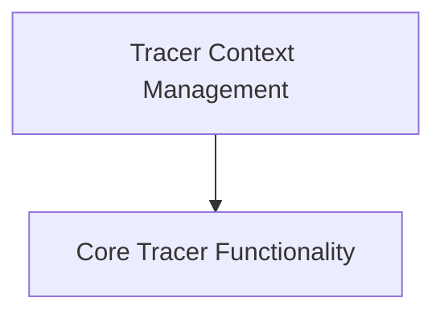

# Core Tracers Module

## Introduction

The `core_tracers` module is responsible for providing the foundational components for tracing and monitoring the execution of various operations within the system. It enables the collection, persistence, and analysis of runtime data for debugging, performance monitoring, and auditing purposes.

## Architecture Overview

The `core_tracers` module is composed of two main sub-modules:
- `tracer_context`: Handles the contextual management of run collectors.
- `tracer_core`: Provides the abstract base for all tracers and core tracing functionalities.

These sub-modules work together to provide a robust tracing framework, allowing different types of runs (LLM, Chain, Tool, Retriever) to be tracked and managed consistently.

<!-- DIAGRAM_JSON
{
    "direction": "TD",
    "nodes": [
        {"id": "tracer_context", "label": "Tracer Context Management", "type": "module", "link": "tracer_context.md"},
        {"id": "tracer_core", "label": "Core Tracer Functionality", "type": "module", "link": "tracer_core.md"}
    ],
    "edges": [
        {"source": "tracer_context", "target": "tracer_core"}
    ],
    "groups": []
}
-->

## Sub-modules

### [Tracer Context Management](tracer_context.md)

This sub-module focuses on managing the context in which run traces are collected. It provides utilities to collect and aggregate execution data, which is crucial for understanding the flow and performance of operations.

### [Core Tracer Functionality](tracer_core.md)

This sub-module defines the abstract base for all tracers and implements the core logic for tracking various types of runs, including LLM (Language Model), Chain, Tool, and Retriever operations. It handles the creation, updating, and error reporting of these runs, ensuring consistent tracing across the system.
