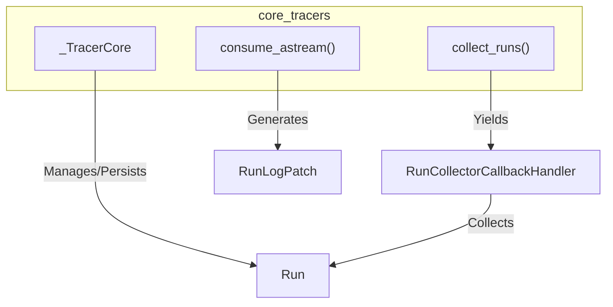

# core_tracers
Provides core tracing functionalities, including an abstract base class for tracers, a context manager for collecting run traces, and utilities for processing async streams into log patches.
<!-- DIAGRAM_JSON
{
  "nodes": [
    {
      "id": "_TracerCore",
      "label": "_TracerCore",
      "type": "class"
    },
    {
      "id": "collect_runs",
      "label": "collect_runs()",
      "type": "function"
    },
    {
      "id": "consume_astream",
      "label": "consume_astream()",
      "type": "function"
    },
    {
      "id": "Run",
      "label": "Run",
      "type": "concept"
    },
    {
      "id": "RunCollectorCallbackHandler",
      "label": "RunCollectorCallbackHandler",
      "type": "class"
    },
    {
      "id": "RunLogPatch",
      "label": "RunLogPatch",
      "type": "class"
    }
  ],
  "edges": [
    {
      "source": "_TracerCore",
      "target": "Run",
      "label": "Manages/Persists"
    },
    {
      "source": "collect_runs",
      "target": "RunCollectorCallbackHandler",
      "label": "Yields"
    },
    {
      "source": "RunCollectorCallbackHandler",
      "target": "Run",
      "label": "Collects"
    },
    {
      "source": "consume_astream",
      "target": "RunLogPatch",
      "label": "Generates"
    }
  ],
  "groups": [
    {
      "id": "core_tracers",
      "label": "core_tracers",
      "nodes": ["_TracerCore", "collect_runs", "consume_astream"]
    }
  ]
}
-->
