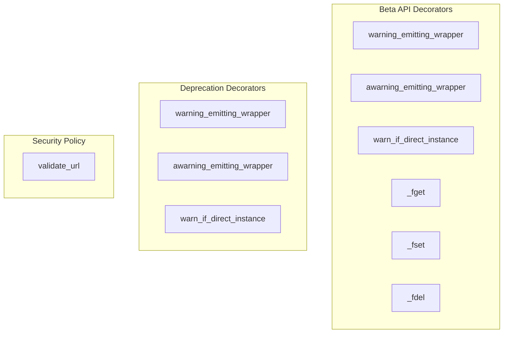

# core_utilities
This module provides core utilities for managing API lifecycle warnings (beta and deprecation) through wrappers and property handlers, alongside robust security features for validating URLs against SSRF policies.

<!-- DIAGRAM_JSON
{
    "nodes": [
        {
            "id": "beta_warn_wrapper",
            "label": "warning_emitting_wrapper"
        },
        {
            "id": "beta_awarn_wrapper",
            "label": "awarning_emitting_wrapper"
        },
        {
            "id": "beta_warn_instance",
            "label": "warn_if_direct_instance"
        },
        {
            "id": "beta_fget",
            "label": "_fget"
        },
        {
            "id": "beta_fset",
            "label": "_fset"
        },
        {
            "id": "beta_fdel",
            "label": "_fdel"
        },
        {
            "id": "deprec_warn_wrapper",
            "label": "warning_emitting_wrapper"
        },
        {
            "id": "deprec_awarn_wrapper",
            "label": "awarning_emitting_wrapper"
        },
        {
            "id": "deprec_warn_instance",
            "label": "warn_if_direct_instance"
        },
        {
            "id": "validate_url",
            "label": "validate_url"
        }
    ],
    "edges": [],
    "groups": [
        {
            "id": "beta_api",
            "label": "Beta API Decorators",
            "nodes": [
                "beta_warn_wrapper",
                "beta_awarn_wrapper",
                "beta_warn_instance",
                "beta_fget",
                "beta_fset",
                "beta_fdel"
            ]
        },
        {
            "id": "deprecation",
            "label": "Deprecation Decorators",
            "nodes": [
                "deprec_warn_wrapper",
                "deprec_awarn_wrapper",
                "deprec_warn_instance"
            ]
        },
        {
            "id": "security",
            "label": "Security Policy",
            "nodes": [
                "validate_url"
            ]
        }
    ]
}
-->
