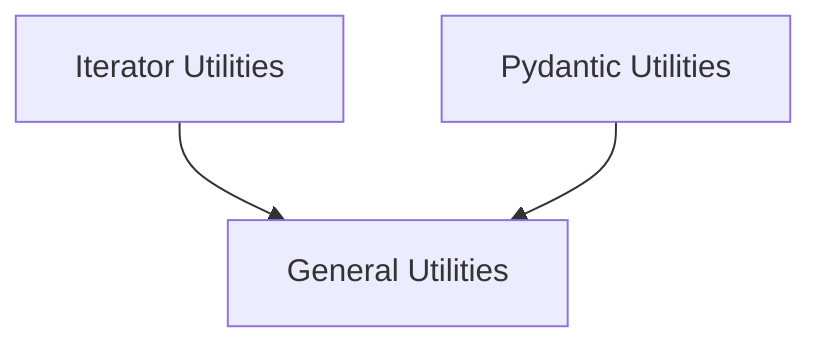

# Core Utilities Module

The `core_utils` module provides a collection of essential utility functions and classes that support various functionalities across the core system. These utilities range from handling asynchronous and synchronous iterations to Pydantic model enhancements and general-purpose helper functions.

## Architecture Overview

The `core_utils` module is structured into several sub-modules, each encapsulating related utility functions. This modular design promotes code reusability, maintainability, and clear separation of concerns.

<!-- DIAGRAM_JSON
{
    "direction": "TD",
    "nodes": [
        {"id": "general_utilities", "label": "General Utilities", "type": "module", "link": "general_utilities.md"},
        {"id": "iterator_utilities", "label": "Iterator Utilities", "type": "module", "link": "iterator_utilities.md"},
        {"id": "pydantic_utilities", "label": "Pydantic Utilities", "type": "module", "link": "pydantic_utilities.md"}
    ],
    "edges": [
        {"source": "iterator_utilities", "target": "general_utilities"},
        {"source": "pydantic_utilities", "target": "general_utilities"}
    ],
    "groups": []
}
-->

## Sub-modules

### [General Utilities](general_utilities.md)
This sub-module contains miscellaneous utility functions, including methods for extracting sub-links from HTML content and a wrapper for validating function arguments.

### [Iterator Utilities](iterator_utilities.md)
This sub-module provides classes for creating multiple independent iterators from a single source, supporting both synchronous and asynchronous contexts.

### [Pydantic Utilities](pydantic_utilities.md)
This sub-module offers helper functions and decorators to enhance Pydantic model functionality, such as custom data validation wrappers and utilities for retrieving Pydantic version information.