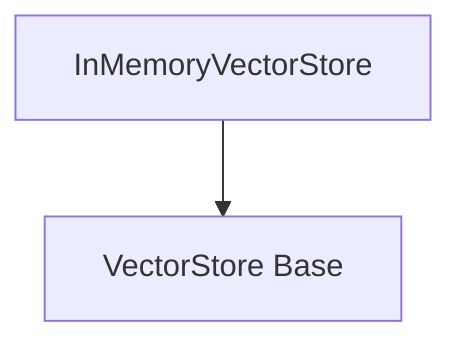

# Core Vector Stores

## Introduction and Purpose

The `core_vectorstores` module provides the foundational interfaces and an in-memory implementation for managing and querying vector embeddings. Vector stores are a crucial component for applications requiring efficient similarity search over large datasets, such as retrieval-augmented generation (RAG) systems. This module defines the contract for how vector stores should operate and offers a basic, efficient in-memory solution.

## Architecture Overview

The module is structured around a central abstract base class, `VectorStore`, which defines the core functionalities. Concrete implementations, like `InMemoryVectorStore`, extend this base class to provide specific storage and retrieval mechanisms.

<!-- DIAGRAM_JSON
{
    "direction": "TD",
    "nodes": [
        {"id": "vectorstore_base", "label": "VectorStore (Abstract Base)", "type": "module"},
        {"id": "in_memory_vectorstore", "label": "InMemoryVectorStore (Implementation)", "type": "module"}
    ],
    "edges": [
        {"source": "in_memory_vectorstore", "target": "vectorstore_base", "label": "inherits from"}
    ],
    "groups": []
}
-->


## Core Functionality

### `VectorStore`

The `VectorStore` is an abstract base class that establishes the standard interface for all vector store implementations. It outlines essential operations for interacting with vector embeddings and associated documents.

**Key features and methods include:**

*   **`add_texts`**: Adds a collection of texts and their associated metadata to the vector store. This method handles embedding the texts and storing them.
*   **`add_documents`**: A higher-level method for adding `Document` objects, internally converting them to texts and metadata before calling `add_texts`.
*   **`delete`**: Removes vectors and documents from the store based on a list of IDs.
*   **`get_by_ids`**: Retrieves `Document` objects given a sequence of their IDs.
*   **`search`**: A versatile search method that dispatches to specific search implementations based on the `search_type` parameter (e.g., 'similarity', 'mmr', 'similarity_score_threshold').
*   **`similarity_search`**: Abstract method for finding documents most similar to a given query.
*   **`similarity_search_with_score`**: Returns documents along with their similarity scores.
*   **`similarity_search_by_vector`**: Finds documents most similar to a given embedding vector.
*   **`max_marginal_relevance_search`**: Performs Maximal Marginal Relevance (MMR) search, optimizing for both similarity to the query and diversity among the results.
*   **`from_texts` / `from_documents`**: Class methods for initializing a vector store from a list of texts or documents.
*   **Asynchronous Methods**: Most core methods have asynchronous counterparts (e.g., `aadd_texts`, `adelete`, `asimilarity_search`) for non-blocking operations.
*   **`as_retriever`**: Converts the vector store into a `VectorStoreRetriever` for easier integration into retrieval chains, allowing configuration of search type and keyword arguments.

### `InMemoryVectorStore`

The `InMemoryVectorStore` provides a concrete, in-memory implementation of the `VectorStore` interface. It stores vector embeddings and documents in a dictionary, making it suitable for local development, testing, or scenarios where persistence is not required.

**Key characteristics:**

*   **In-Memory Storage**: Data is stored as Python objects in memory, offering fast access but non-persistence across application restarts.
*   **Cosine Similarity**: Utilizes `numpy` for efficient calculation of cosine similarity during vector searches.
*   **Embedding Function Integration**: Requires an `Embeddings` object during initialization to generate vector representations of text.
*   **Full `VectorStore` API Implementation**: Provides concrete implementations for all abstract methods defined in `VectorStore`, including `add_documents`, `delete`, `similarity_search`, `max_marginal_relevance_search`, and their asynchronous variants.
*   **Filtering**: Supports filtering search results based on document metadata.
*   **Serialization**: Includes `load` and `dump` methods to serialize and deserialize the in-memory store to/from a file (JSON format), allowing for basic persistence if needed.

**Example Usage (from component code):**

```python
from langchain_core.vectorstores import InMemoryVectorStore
from langchain_openai import OpenAIEmbeddings
from langchain_core.documents import Document

# Instantiate with an embedding function
vector_store = InMemoryVectorStore(OpenAIEmbeddings())

# Add documents
document_1 = Document(id="1", page_content="foo", metadata={"baz": "bar"})
document_2 = Document(id="2", page_content="thud", metadata={"bar": "baz"})
documents = [document_1, document_2]
vector_store.add_documents(documents=documents)

# Search
results = vector_store.similarity_search(query="thud", k=1)
for doc in results:
    print(f"* {doc.page_content} [{doc.metadata}]")
# Expected: * thud [{'bar': 'baz'}]

# Search with score
results = vector_store.similarity_search_with_score(query="qux", k=1)
for doc, score in results:
    print(f"* [SIM={score:3f}] {doc.page_content} [{doc.metadata}]")
# Expected: * [SIM=0.832268] foo [{'baz': 'bar'}]
```
