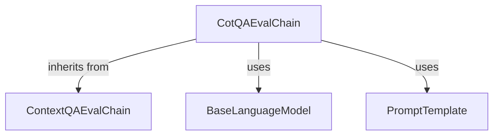

# cot_qa_eval_chain

The `cot_qa_eval_chain` module provides the `CotQAEvalChain` class, an LLM chain specifically designed for evaluating Question-Answering (QA) systems using a Chain of Thought (CoT) reasoning approach. This module extends the base contextual QA evaluation capabilities to incorporate detailed reasoning steps from the language model, offering a more transparent and robust evaluation.

## Architecture and Component Relationships

This module contains a single core component, `CotQAEvalChain`, which inherits from `ContextQAEvalChain` (found in the `qa_evaluation_chains_core` module). It leverages external components such as `BaseLanguageModel` for its underlying language model capabilities and `PromptTemplate` to define the structure of the evaluation prompts.

<!-- DIAGRAM_JSON
{
    "direction": "TD",
    "nodes": [
        {"id": "cot_qa_eval_chain", "label": "CotQAEvalChain", "type": "component", "link": null},
        {"id": "context_qa_eval_chain", "label": "ContextQAEvalChain", "type": "external", "link": "qa_evaluation_chains_core.md"},
        {"id": "base_language_model", "label": "BaseLanguageModel", "type": "external", "link": "core_language_models.md"},
        {"id": "prompt_template", "label": "PromptTemplate", "type": "external", "link": "core_prompts.md"}
    ],
    "edges": [
        {"source": "cot_qa_eval_chain", "target": "context_qa_eval_chain", "label": "inherits from"},
        {"source": "cot_qa_eval_chain", "target": "base_language_model", "label": "uses"},
        {"source": "cot_qa_eval_chain", "target": "prompt_template", "label": "uses"}
    ],
    "groups": []
}
-->

## Core Functionality

### `CotQAEvalChain`

`CotQAEvalChain` is an LLM chain designed for evaluating the accuracy of Question-Answering (QA) responses by prompting a language model to generate a "chain of thought" before providing its final judgment. This allows for a deeper understanding of the evaluation process and helps in debugging or improving QA systems.

**Key Features:**

*   **Chain of Thought Reasoning**: Facilitates more robust QA evaluation by requiring the LLM to explain its reasoning.
*   **Customizable Prompting**: Allows for the specification of a custom `PromptTemplate` to guide the CoT evaluation process.
*   **Inheritance**: Extends `ContextQAEvalChain`, inheriting its foundational contextual QA evaluation capabilities.
*   **Evaluation Name**: Clearly defines its purpose with the `evaluation_name` property returning "COT Contextual Accuracy".

**Methods:**

*   `is_lc_serializable(cls) -> bool`: Returns `False`, indicating that this class is not designed for LangChain's serialization mechanism.
*   `evaluation_name(self) -> str`: A property that returns the string "COT Contextual Accuracy", identifying the type of evaluation performed.
*   `from_llm(cls, llm: BaseLanguageModel, prompt: PromptTemplate | None = None, **kwargs: Any) -> CotQAEvalChain`: A class method to construct an instance of `CotQAEvalChain`. It takes a `BaseLanguageModel` and an optional `PromptTemplate`. If no prompt is provided, it defaults to `COT_PROMPT`. It also includes validation for input variables in the prompt.

## How it Fits into the Overall System

The `cot_qa_eval_chain` module is a specialized component within the larger `classic_evaluation_qa` system. It provides a specific, advanced method for evaluating QA chains by incorporating Chain of Thought reasoning. This module is crucial for developers and researchers who need a more detailed and interpretable evaluation of their QA models, moving beyond simple accuracy metrics to understand the *why* behind an LLM's assessment. It integrates with other core LangChain components like language models and prompt templates to build powerful evaluation pipelines.