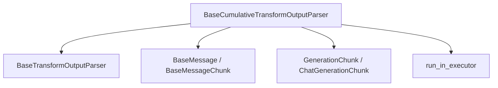

# cumulative_transformation_parsers

**Module Path:** `libs/core/langchain_core/output_parsers/transform/cumulative_transformation_parsers`

This module provides the `BaseCumulativeTransformOutputParser`, a foundational class for output parsers that can handle streaming input and provide cumulative transformations, optionally yielding diffs between successive parsed outputs.

## Architecture and Component Relationships

This module's core component, `BaseCumulativeTransformOutputParser`, extends the functionality of `BaseTransformOutputParser` to process data in a streaming fashion. It interacts with core message and generation types to build up a complete parsed output from incremental chunks.

<!-- DIAGRAM_JSON
{
    "direction": "TD",
    "nodes": [
        {"id": "base_cumulative_transform_output_parser", "label": "BaseCumulativeTransformOutputParser", "type": "component", "link": null},
        {"id": "base_transform_output_parser", "label": "BaseTransformOutputParser", "type": "external", "link": "base_transformation_parsers.md"},
        {"id": "base_message", "label": "BaseMessage / BaseMessageChunk", "type": "external", "link": "core_messages.md"},
        {"id": "generation_chunk", "label": "GenerationChunk / ChatGenerationChunk", "type": "external", "link": "core_api.md"},
        {"id": "run_in_executor", "label": "run_in_executor", "type": "external", "link": "core_utils.md"}
    ],
    "edges": [
        {"source": "base_cumulative_transform_output_parser", "target": "base_transform_output_parser"},
        {"source": "base_cumulative_transform_output_parser", "target": "base_message"},
        {"source": "base_cumulative_transform_output_parser", "target": "generation_chunk"},
        {"source": "base_cumulative_transform_output_parser", "target": "run_in_executor"}
    ],
    "groups": []
}
-->



## Core Components

### `BaseCumulativeTransformOutputParser`

```python
class BaseCumulativeTransformOutputParser(BaseTransformOutputParser[T]):
    """Base class for an output parser that can handle streaming input."""

    diff: bool = False
    """In streaming mode, whether to yield diffs between the previous and current parsed
    output, or just the current parsed output.
    """

    def _diff(
        self,
        prev: T | None,
        next: T,  # noqa: A002
    ) -> T:
        """Convert parsed outputs into a diff format.

        The semantics of this are up to the output parser.

        Args:
            prev: The previous parsed output.
            next: The current parsed output.

        Returns:
            The diff between the previous and current parsed output.
        """
        raise NotImplementedError

    @override
    def _transform(self, input: Iterator[str | BaseMessage]) -> Iterator[Any]:
        prev_parsed = None
        acc_gen: GenerationChunk | ChatGenerationChunk | None = None
        for chunk in input:
            chunk_gen: GenerationChunk | ChatGenerationChunk
            if isinstance(chunk, BaseMessageChunk):
                chunk_gen = ChatGenerationChunk(message=chunk)
            elif isinstance(chunk, BaseMessage):
                chunk_gen = ChatGenerationChunk(
                    message=BaseMessageChunk(**chunk.model_dump())
                )
            else:
                chunk_gen = GenerationChunk(text=chunk)

            acc_gen = chunk_gen if acc_gen is None else acc_gen + chunk_gen  # type: ignore[operator]

            parsed = self.parse_result([acc_gen], partial=True)
            if parsed is not None and parsed != prev_parsed:
                if self.diff:
                    yield self._diff(prev_parsed, parsed)
                else:
                    yield parsed
                prev_parsed = parsed

    @override
    async def _atransform(
        self, input: AsyncIterator[str | BaseMessage]
    ) -> AsyncIterator[T]:
        prev_parsed = None
        acc_gen: GenerationChunk | ChatGenerationChunk | None = None
        async for chunk in input:
            chunk_gen: GenerationChunk | ChatGenerationChunk
            if isinstance(chunk, BaseMessageChunk):
                chunk_gen = ChatGenerationChunk(message=chunk)
            elif isinstance(chunk, BaseMessage):
                chunk_gen = ChatGenerationChunk(
                    message=BaseMessageChunk(**chunk.model_dump())
                )
            else:
                chunk_gen = GenerationChunk(text=chunk)

            acc_gen = chunk_gen if acc_gen is None else acc_gen + chunk_gen  # type: ignore[operator]

            parsed = await self.aparse_result([acc_gen], partial=True)
            if parsed is not None and parsed != prev_parsed:
                if self.diff:
                    yield await run_in_executor(None, self._diff, prev_parsed, parsed)
                else:
                    yield parsed
                prev_parsed = parsed
```

This abstract base class provides the fundamental logic for incrementally parsing streaming output. It inherits from `BaseTransformOutputParser` and adds the concept of `diff`ing, allowing it to yield only the changes between consecutive parsed states.

Key features:

*   **Streaming Input:** Processes input as an iterator or async iterator of `str` or `BaseMessage` chunks.
*   **Cumulative Parsing:** Accumulates input chunks and calls `parse_result(..., partial=True)` on the accumulated data to get the current parsed state.
*   **Diffing Capability:** If `diff` is set to `True`, the parser will yield the difference between the current parsed output and the previous one, as determined by the `_diff` method (which must be implemented by subclasses).
*   **Asynchronous Support:** Provides both synchronous (`_transform`) and asynchronous (`_atransform`) methods for handling streaming transformations.