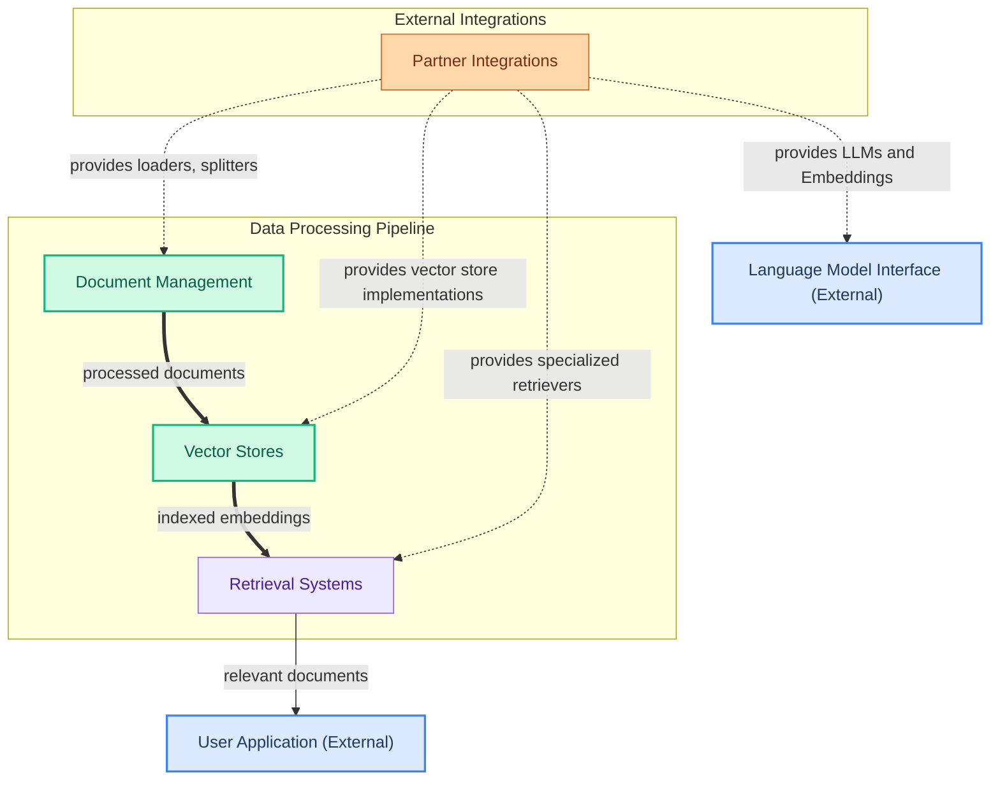

The `data_and_integrations` module is the backbone for managing and interacting with external data sources and various AI service providers. It provides comprehensive functionalities for loading, splitting, indexing, and organizing documents, enabling efficient data preparation for language model applications. Furthermore, it includes robust retrieval systems for fetching relevant information and a flexible vector store interface for embedding-based search. A wide array of partner integrations ensures seamless connectivity with diverse LLM providers, search engines, and vector databases, making the module highly extensible and adaptable.

### How it Works

The `data_and_integrations` module orchestrates the flow of data from ingestion to retrieval, leveraging external partners for specialized services.

1.  **Document Management**: This component handles the initial ingestion of raw documents from various sources, splits them into manageable chunks, and prepares them for indexing.
2.  **Vector Stores**: Processed documents are then stored in vector databases, which convert text into numerical embeddings for efficient similarity search.
3.  **Retrieval Systems**: When a user query is received, the retrieval systems query the vector stores to fetch the most relevant documents or document chunks. These results are then passed to the user application or further processing.
4.  **Partner Integrations**: This crucial component provides the necessary connectors and implementations for interacting with external services. It supplies document loaders, specific vector store backends (e.g., Qdrant), specialized retrievers (e.g., Exa Search), and integrates with various Language Model (LLM) and embedding providers (e.g., Anthropic, OpenAI, Hugging Face) via the Language Model Interface.

### Core Components Documentation

*   **Document Management**: [document_management.md](document_management.md)
*   **Retrieval Systems**: [retrieval_systems.md](retrieval_systems.md)
*   **Vector Stores**: [vector_stores.md](vector_stores.md)
*   **Partner Integrations**: [partner_integrations.md](partner_integrations.md)