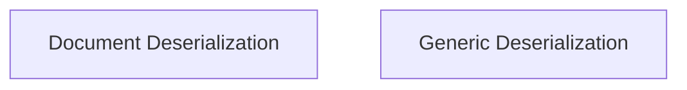

# Data Deserialization Module

## Introduction and Purpose

The `data_deserialization` module is responsible for converting byte streams back into Python objects, primarily within the context of the classic LangChain storage system. It provides core utilities for reconstructing `Document` and other `Serializable` objects from their serialized byte representations, ensuring data integrity during retrieval.

## Architecture Overview

The module is composed of two primary sub-modules:

*   **Document Deserialization**: Focuses on the specific task of deserializing `Document` objects.
*   **Generic Deserialization**: Offers a more generalized approach to deserialize any `Serializable` object.

These sub-modules work in tandem to provide robust deserialization capabilities for the storage layer, allowing for flexible data reconstruction based on the expected object type.

### Module Relationships

<!-- DIAGRAM_JSON
{
    "direction": "TD",
    "nodes": [
        {"id": "document_deserialization", "label": "Document Deserialization", "type": "module", "link": "document_deserialization.md"},
        {"id": "generic_deserialization", "label": "Generic Deserialization", "type": "module", "link": "generic_deserialization.md"}
    ],
    "edges": [
        
    ],
    "groups": []
}
-->

## High-Level Functionality

*   **[Document Deserialization](document_deserialization.md)**: This sub-module contains functions specifically designed to take a byte stream and convert it into a `Document` object. It includes type checking to ensure that the deserialized object is indeed a `Document`.

*   **[Generic Deserialization](generic_deserialization.md)**: This sub-module provides a general-purpose function for deserializing byte streams into any `Serializable` Python object. It's a foundational utility for broader data reconstruction needs.
