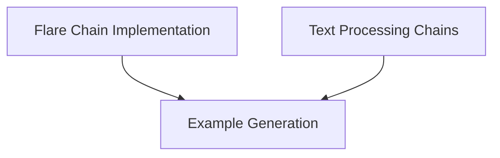

# Data Processing Chains

The `data_processing_chains` module provides a collection of specialized chains designed for various text processing tasks. These include generating examples for prompts, implementing advanced retrieval-augmented generation with the FLARE chain, and handling large-scale text transformation and question-answering with Map-Reduce and QA Generation chains.

## Architecture Overview

The module is structured into three main sub-modules, each focusing on a distinct aspect of data processing:

<!-- DIAGRAM_JSON
{
    "direction": "TD",
    "nodes": [
        {"id": "example_generation", "label": "Example Generation", "type": "module", "link": "example_generation.md"},
        {"id": "flare_chain", "label": "Flare Chain Implementation", "type": "module", "link": "flare_chain.md"},
        {"id": "text_processing_chains", "label": "Text Processing Chains", "type": "module", "link": "text_processing_chains.md"}
    ],
    "edges": [
        {"source": "flare_chain", "target": "example_generation"},
        {"source": "text_processing_chains", "target": "example_generation"}
    ],
    "groups": []
}
-->

## Sub-modules

### [Example Generation](example_generation.md)
This sub-module is responsible for generating new examples based on a provided list of existing examples and a prompt template. It is useful for few-shot learning scenarios and expanding training data.

### [Flare Chain Implementation](flare_chain.md)
This sub-module provides the `FlareChain`, an advanced chain for Active Retrieval Augmented Generation. It dynamically generates responses by iteratively posing questions about uncertain spans, retrieving relevant documents, and refining the output.

### [Text Processing Chains](text_processing_chains.md)
This sub-module includes functionalities for processing large text documents. It features the `MapReduceChain` for summarizing or transforming extensive content, and the `QAGenerationChain` for automatically generating question-answer pairs from provided text. This sub-module also interacts with text splitting utilities for efficient document handling.
