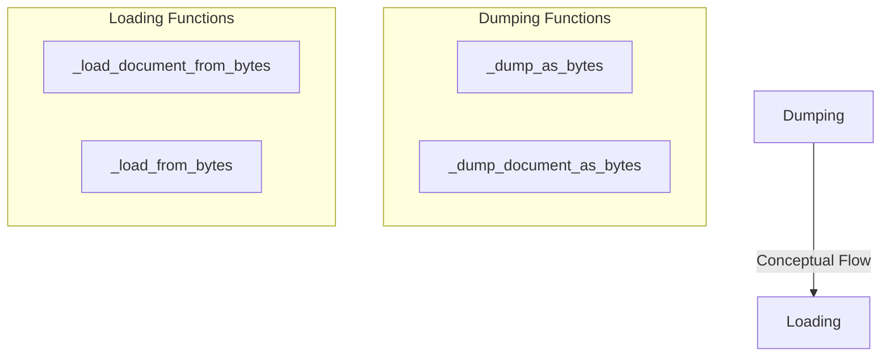

# data_serialization
This module provides utilities for serializing and deserializing various data types, including `Document` objects, to and from byte representations. It offers functions for both general `Serializable` objects and specific `Document` instances.

<!-- DIAGRAM_JSON
{
    "nodes": [
        {
            "id": "_dump_as_bytes",
            "label": "_dump_as_bytes"
        },
        {
            "id": "_dump_document_as_bytes",
            "label": "_dump_document_as_bytes"
        },
        {
            "id": "_load_document_from_bytes",
            "label": "_load_document_from_bytes"
        },
        {
            "id": "_load_from_bytes",
            "label": "_load_from_bytes"
        }
    ],
    "edges": [
        {
            "source": "_dump_as_bytes",
            "target": "_load_document_from_bytes",
            "label": "Conceptual Flow"
        }
    ],
    "groups": [
        {
            "id": "Dumping",
            "label": "Dumping Functions",
            "nodes": [
                "_dump_as_bytes",
                "_dump_document_as_bytes"
            ]
        },
        {
            "id": "Loading",
            "label": "Loading Functions",
            "nodes": [
                "_load_document_from_bytes",
                "_load_from_bytes"
            ]
        }
    ]
}
-->
