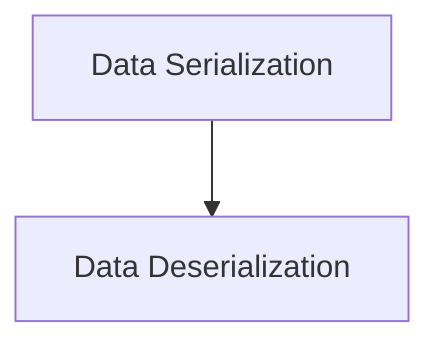

# Data Serialization Module

## Introduction
The `data_serialization` module provides core utilities for converting Python objects, particularly `Document` instances, into a bytes representation suitable for storage or transmission. This module ensures that data can be consistently and reliably serialized within the system.

## Core Functionality

### `_dump_as_bytes`
This utility function is responsible for serializing any `Serializable` object into a UTF-8 encoded bytes string. It leverages a general dumping mechanism to convert the object into a string format before encoding.

**Component ID:** `libs.langchain.langchain_classic.storage._lc_store._dump_as_bytes`

### `_dump_document_as_bytes`
This function specifically handles the serialization of `Document` instances into a UTF-8 encoded bytes string. It includes a type check to ensure that only `Document` objects are processed, raising a `TypeError` if an unexpected object type is provided. This ensures data integrity when dealing with document storage.

**Component ID:** `libs.langchain.langchain_classic.storage._lc_store._dump_document_as_bytes`

## Architecture
The `data_serialization` module is a fundamental part of the `classic_storage` package, working in conjunction with the [data_deserialization](data_deserialization.md) module to manage the persistence and retrieval of data. It provides the necessary mechanisms to transform in-memory objects into a storable format.

<!-- DIAGRAM_JSON
{
    "direction": "TD",
    "nodes": [
        {"id": "data_serialization", "label": "Data Serialization", "type": "module", "link": "data_serialization.md"},
        {"id": "data_deserialization", "label": "Data Deserialization", "type": "module", "link": "data_deserialization.md"}
    ],
    "edges": [
        {"source": "data_serialization", "target": "data_deserialization"}
    ],
    "groups": []
}
-->

