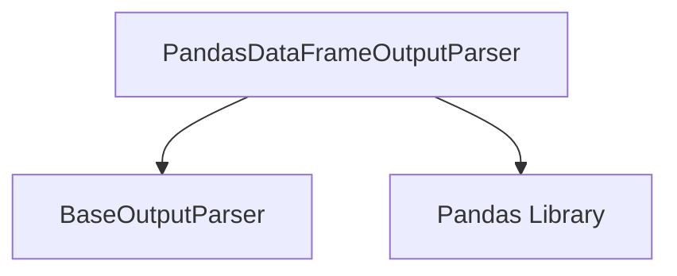

# Dataframe Parser Module

The `dataframe_parser` module provides robust functionality for parsing outputs and interacting with Pandas DataFrames. It enables dynamic querying and manipulation of dataframes based on structured requests, supporting various data extraction and aggregation operations.

## Purpose and Core Functionality

The primary purpose of this module is to interpret specific string requests into executable operations on a Pandas DataFrame. It is designed to facilitate interactions with dataframes in a structured and predictable manner, making it ideal for scenarios where language models or other systems need to extract, filter, or aggregate data from a DataFrame.

Key functionalities include:
-   **Structured Request Parsing**: Interprets requests for columns, rows, or statistical operations.
-   **Array Parsing**: Handles various array formats (e.g., index lists, index ranges, column name lists) for precise data filtering.
-   **DataFrame Validation**: Ensures that the provided DataFrame is valid and non-empty before processing.
-   **Error Handling**: Provides detailed exceptions for malformed requests, invalid operations, or out-of-bounds access.

## Architecture and Component Relationships

<!-- DIAGRAM_JSON
{
    "direction": "TD",
    "nodes": [
        {"id": "pandas_dataframe_output_parser", "label": "PandasDataFrameOutputParser", "type": "component", "link": null},
        {"id": "base_output_parser", "label": "BaseOutputParser", "type": "external", "link": "base_parser_definitions.md"},
        {"id": "pandas", "label": "Pandas Library", "type": "external", "link": null}
    ],
    "edges": [
        {"source": "pandas_dataframe_output_parser", "target": "base_output_parser"},
        {"source": "pandas_dataframe_output_parser", "target": "pandas"}
    ],
    "groups": []
}
-->


The `dataframe_parser` module contains the `PandasDataFrameOutputParser` which extends the `BaseOutputParser` (from [base_parser_definitions.md](base_parser_definitions.md)) to provide specialized parsing for Pandas DataFrames. It directly interacts with the `pandas` library for all DataFrame operations and validations.

## Core Components

### `PandasDataFrameOutputParser`

`libs.langchain.langchain_classic.output_parsers.pandas_dataframe.PandasDataFrameOutputParser`

This class is the central component of the `dataframe_parser` module. It is responsible for parsing string requests into operations that can be performed on a Pandas DataFrame. It inherits from `BaseOutputParser`, allowing it to fit into a broader output parsing framework.

#### Overview

The `PandasDataFrameOutputParser` takes a Pandas DataFrame during initialization and then uses its `parse` method to process structured requests. These requests can specify operations like retrieving a column, a row, or applying an aggregation function (e.g., `sum`, `mean`) to a specified part of the DataFrame. The parser handles different array formats for filtering and includes robust validation and error handling.

#### Class Attributes

*   **`dataframe`**: Stores the Pandas DataFrame instance that the parser will operate on. It is subject to a validator (`_validate_dataframe`) to ensure it is a valid and non-empty DataFrame.

#### Methods

##### `_validate_dataframe(cls, val: Any) -> Any`

This class method acts as a validator for the `dataframe` attribute. It ensures that the provided value (`val`) is a subclass of `pandas.DataFrame` and that it is not empty. If the validation fails, it raises a `ValueError` or `TypeError`.

##### `parse_array(self, array: str, original_request_params: str) -> tuple[list[int | str], str]`

Parses an array string from the request parameters. It supports three formats:

*   **Integer list**: `[1,3,5]`
*   **Integer range**: `[1..5]` (inclusive)
*   **Column name list**: `["column_name", "another_column"]`

After parsing, it validates the array to ensure it's not empty and that any integer indices do not exceed the DataFrame's maximum index. It returns the parsed array and the stripped request parameters.

*   **Parameters**:
    *   `array` (`str`): The array string to be parsed (e.g., `"[1,3,5]"`, `"[1..5]"`, `"["col1","col2"]"`).
    *   `original_request_params` (`str`): The full original request parameters string, used for error messages.

*   **Returns**:
    *   `tuple[list[int | str], str]`: A tuple containing the parsed array (list of integers or strings) and the request parameters string with the array part removed.

*   **Raises**:
    *   `OutputParserException`: If the array format is invalid, cannot be parsed, or contains out-of-bounds indices.

##### `parse(self, request: str) -> dict[str, Any]`

This is the main method for parsing the complete request string. It expects the request in the format `request_type:request_params`. It first validates the overall request format and then determines the operation based on `request_type`.

It handles three main `request_type`s:

*   **`"column"`**: Retrieves a specific column or columns (if an array is provided) from the DataFrame.
*   **`"row"`**: Retrieves a specific row or rows (if an array is provided) from the DataFrame.
*   **Other (Aggregation)**: Applies a method (e.g., `sum`, `mean`, `min`, `max`) to a specified column or filtered part of the DataFrame. The `request_type` must correspond to a valid Pandas Series method.

The method uses `parse_array` internally if the `request_params` include an array.

*   **Parameters**:
    *   `request` (`str`): The request string (e.g., `"column:name"`, `"row:1"`, `"sum:age[1..5]"`, `"mean:salary["finance","tech"]"`).

*   **Returns**:
    *   `dict[str, Any]`: A dictionary containing the result of the parsed operation. The key will typically be the `request_type` or `stripped_request_params`.

*   **Raises**:
    *   `OutputParserException`: For malformed requests, unsupported request types, invalid column/row names, or out-of-bounds access.

##### `get_format_instructions(self) -> str`

Returns a string providing instructions on the expected format for requests. This method dynamically includes the DataFrame's column names in the instructions.

*   **Returns**:
    *   `str`: A string detailing the format instructions.

#### Error Handling

The `PandasDataFrameOutputParser` includes comprehensive error handling, primarily through `OutputParserException`.

Common scenarios that trigger exceptions include:

*   **Invalid Request Format**: If the request string does not adhere to the `request_type:request_params` structure.
*   **Invalid Array Format**: If the array part of the request (e.g., `[1,3,5]`) is malformed.
*   **Out-of-Bounds Indexing**: If a requested row index or array index exceeds the DataFrame's actual index range.
*   **Invalid Column/Operation**: If a requested column name does not exist, or an aggregation `request_type` is not a valid Pandas Series method.

#### Usage Example

```python
import pandas as pd
from langchain_classic.output_parsers.pandas_dataframe import PandasDataFrameOutputParser
from langchain_core.exceptions import OutputParserException

# Sample DataFrame
data = {
    "name": ["Alice", "Bob", "Charlie", "David", "Eve"],
    "age": [24, 27, 22, 32, 29],
    "city": ["New York", "London", "Paris", "London", "New York"],
    "salary": [70000, 80000, 65000, 95000, 75000]
}
df = pd.DataFrame(data)

# Initialize the parser
parser = PandasDataFrameOutputParser(dataframe=df)

# Example 1: Get a specific column
request_column = "column:name"
parsed_column = parser.parse(request_column)
print(f"Parsed Column (name): {parsed_column}")
# Expected: {'name': 0        Alice
1          Bob
2      Charlie
3        David
4          Eve
Name: name, dtype: object}

# Example 2: Get a specific row
request_row = "row:1"
parsed_row = parser.parse(request_row)
print(f"Parsed Row (index 1): {parsed_row}")
# Expected: {'1': name      Bob
age        27
city    London
salary   80000
Name: 1, dtype: object}

# Example 3: Get the mean of a column for specific indices
request_mean_age = "mean:age[1..3]"
parsed_mean_age = parser.parse(request_mean_age)
print(f"Parsed Mean (age for indices 1-3): {parsed_mean_age}")
# Expected: {'mean': 27.0}

# Example 4: Get a specific column for specific indices
request_filtered_column = "column:city[0,2,4]"
parsed_filtered_column = parser.parse(request_filtered_column)
print(f"Parsed Filtered Column (city for indices 0,2,4): {parsed_filtered_column}")
# Expected: {'city': 0    New York
2       Paris
4    New York
Name: city, dtype: object}

# Example 5: Get sum of salary for specific column names within a row operation (conceptually not directly supported this way but for illustration)
# This is actually retrieving specific columns of a specific row, not summing across columns
request_row_cols = "row:0[name,salary]"
parsed_row_cols = parser.parse(request_row_cols)
print(f"Parsed Row (index 0, cols name, salary): {parsed_row_cols}")
# Expected: {'0': name     Alice
salary    70000
Name: 0, dtype: object}

# Example 6: Invalid request format
try:
    invalid_request = "invalid request string"
    parser.parse(invalid_request)
except OutputParserException as e:
    print(f"Error parsing \"{invalid_request}\": {e}")

# Example 7: Out of bounds index
try:
    oob_request = "row:10"
    parser.parse(oob_request)
except OutputParserException as e:
    print(f"Error parsing \"{oob_request}\": {e}")

# Example 8: Invalid column name
try:
    invalid_column = "column:nonexistent_column"
    parser.parse(invalid_column)
except OutputParserException as e:
    print(f"Error parsing \"{invalid_column}\": {e}")
```