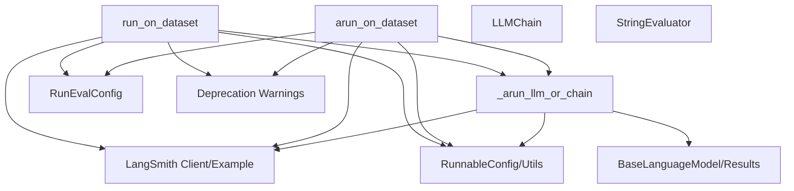

# `dataset_execution_utilities`

## Introduction

The `dataset_execution_utilities` module is responsible for orchestrating the execution of Language Models (LLMs) or Chains against a given dataset, primarily for evaluation and testing purposes. It facilitates both synchronous and asynchronous execution, logs traces to LangSmith, and applies configured evaluators to the results. This module is a core part of the evaluation framework, enabling developers to assess the performance of their LLMs and Chains in a structured and reproducible manner.

## Architecture

This module integrates with the LangSmith platform for dataset management and trace logging, and leverages core LangChain components such as Language Models, Chains, and Runnable configurations. It provides utility functions to run models or chains on individual examples and aggregates the results across an entire dataset.

<!-- DIAGRAM_JSON
{
    "direction": "TD",
    "nodes": [
        {"id": "run_on_dataset", "label": "run_on_dataset", "type": "component", "link": null},
        {"id": "arun_on_dataset", "label": "arun_on_dataset", "type": "component", "link": null},
        {"id": "_arun_llm_or_chain", "label": "_arun_llm_or_chain", "type": "component", "link": null},
        {"id": "langsmith", "label": "LangSmith Client/Example", "type": "external", "link": null},
        {"id": "classic_smith_evaluation", "label": "RunEvalConfig", "type": "external", "link": "classic_smith_evaluation.md"},
        {"id": "classic_chains", "label": "LLMChain", "type": "external", "link": "classic_chains.md"},
        {"id": "classic_evaluation", "label": "StringEvaluator", "type": "external", "link": "classic_evaluation.md"},
        {"id": "core_runnables", "label": "RunnableConfig/Utils", "type": "external", "link": "core_runnables.md"},
        {"id": "core_api", "label": "Deprecation Warnings", "type": "external", "link": "core_api.md"},
        {"id": "core_language_models", "label": "BaseLanguageModel/Results", "type": "external", "link": "core_language_models.md"}
    ],
    "edges": [
        {"source": "run_on_dataset", "target": "_arun_llm_or_chain"},
        {"source": "run_on_dataset", "target": "langsmith"},
        {"source": "run_on_dataset", "target": "classic_smith_evaluation"},
        {"source": "run_on_dataset", "target": "core_runnables"},
        {"source": "run_on_dataset", "target": "core_api"},
        {"source": "arun_on_dataset", "target": "_arun_llm_or_chain"},
        {"source": "arun_on_dataset", "target": "langsmith"},
        {"source": "arun_on_dataset", "target": "classic_smith_evaluation"},
        {"source": "arun_on_dataset", "target": "core_runnables"},
        {"source": "arun_on_dataset", "target": "core_api"},
        {"source": "_arun_llm_or_chain", "target": "langsmith"},
        {"source": "_arun_llm_or_chain", "target": "core_runnables"},
        {"source": "_arun_llm_or_chain", "target": "core_language_models"}
    ],
    "groups": []
}
-->


### Relationships

*   **`run_on_dataset` / `arun_on_dataset`**: These are the primary entry points for running evaluations. They handle the overall process, including preparing the run environment, executing the LLM/Chain on each example, and finalizing the results with evaluations. Both rely on `_arun_llm_or_chain` for individual example execution.
*   **`_arun_llm_or_chain`**: This internal helper function is responsible for the actual execution of a single LLM or Chain against an example from the dataset. It handles potential errors during execution and ensures proper configuration and callback handling.
*   **LangSmith Integration**: Both `run_on_dataset` and `arun_on_dataset` heavily interact with the LangSmith client to fetch datasets, log traces, and potentially store feedback and evaluation results.
*   **Evaluators**: The module utilizes `RunEvalConfig` from [classic_smith_evaluation](classic_smith_evaluation.md) to define and apply various evaluators (e.g., QA, embedding distance, custom evaluators) to the generated outputs.
*   **Core LangChain Components**: The module works with various core LangChain components such as [classic_chains](classic_chains.md) (e.g., `LLMChain`), [core_language_models](core_language_models.md) (e.g., `BaseLanguageModel`), and [core_runnables](core_runnables.md) (e.g., `RunnableConfig`) for execution and configuration.
*   **Utility Functions**: It uses utilities for deprecation warnings from [core_api](core_api.md) and concurrency management from [core_runnables](core_runnables.md).

## Core Components

### `run_on_dataset`

```python
def run_on_dataset(
    client: Client | None,
    dataset_name: str,
    llm_or_chain_factory: MODEL_OR_CHAIN_FACTORY,
    *,
    evaluation: smith_eval.RunEvalConfig | None = None,
    dataset_version: datetime | str | None = None,
    concurrency_level: int = 5,
    project_name: str | None = None,
    project_metadata: dict[str, Any] | None = None,
    verbose: bool = False,
    revision_id: str | None = None,
    **kwargs: Any,
) -> dict[str, Any]:
    # ... (code omitted for brevity)
```

**Purpose:** This synchronous function executes a specified Language Model or Chain against a dataset. It is designed for evaluation and testing, logging all traces to a LangSmith project, and applying configured evaluators to the results. It handles concurrent execution for efficiency.

**Parameters:**

*   `client`: An optional LangSmith `Client` instance for interacting with the LangSmith platform. If `None`, a default client is initialized.
*   `dataset_name`: The name of the dataset to run the evaluation on.
*   `llm_or_chain_factory`: A constructor function for the Language Model or Chain to be run. Using a factory ensures a fresh instance for each example, preventing state contamination.
*   `evaluation`: An optional [RunEvalConfig](classic_smith_evaluation.md#run_eval_config) object to specify which evaluators to run on the outputs.
*   `dataset_version`: An optional version of the dataset to use.
*   `concurrency_level`: The number of concurrent tasks to execute. Defaults to 5.
*   `project_name`: The name of the LangSmith project where traces will be stored. Defaults to `{dataset_name}-{chain class name}-{datetime}`.
*   `project_metadata`: Optional metadata to associate with the project, useful for tracking test variants.
*   `verbose`: If `True`, prints progress during execution.
*   `revision_id`: An optional identifier to track the performance of different system versions.
*   `**kwargs`: Deprecated arguments, primarily for backward compatibility.

**Returns:** A dictionary containing the project name and the collected model outputs.

### `arun_on_dataset`

```python
async def arun_on_dataset(
    client: Client | None,
    dataset_name: str,
    llm_or_chain_factory: MODEL_OR_CHAIN_FACTORY,
    *,
    evaluation: smith_eval.RunEvalConfig | None = None,
    dataset_version: datetime | str | None = None,
    concurrency_level: int = 5,
    project_name: str | None = None,
    project_metadata: dict[str, Any] | None = None,
    verbose: bool = False,
    revision_id: str | None = None,
    **kwargs: Any,
) -> dict[str, Any]:
    # ... (code omitted for brevity)
```

**Purpose:** This asynchronous function is the async counterpart to `run_on_dataset`. It provides the same core functionality – executing an LLM or Chain against a dataset for evaluation, logging traces to LangSmith, and applying evaluators – but is optimized for asynchronous environments, typically offering faster execution.

**Parameters:**

*   `client`: An optional LangSmith `Client` instance.
*   `dataset_name`: The name of the dataset.
*   `llm_or_chain_factory`: A constructor for the Language Model or Chain.
*   `evaluation`: An optional [RunEvalConfig](classic_smith_evaluation.md#run_eval_config) object.
*   `dataset_version`: Optional dataset version.
*   `concurrency_level`: The number of async tasks to run concurrently. Defaults to 5.
*   `project_name`: The name of the LangSmith project.
*   `project_metadata`: Optional metadata for the project.
*   `verbose`: If `True`, prints progress.
*   `revision_id`: Optional revision identifier.
*   `**kwargs`: Deprecated arguments.

**Returns:** A dictionary containing the project name and the collected model outputs.

### `_arun_llm_or_chain`

```python
async def _arun_llm_or_chain(
    example: Example,
    config: RunnableConfig,
    *,
    llm_or_chain_factory: MCF,
    input_mapper: Callable[[dict], Any] | None = None,
) -> dict | str | LLMResult | ChatResult:
    # ... (code omitted for brevity)
```

**Purpose:** This is an internal asynchronous helper function that executes a single instance of a Language Model or Chain against a given `example` from a dataset. It handles the invocation, collects the output, and catches any exceptions that occur during the run, returning an `EvalError` in case of failure. This function is called by `arun_on_dataset` for each example.

**Parameters:**

*   `example`: The LangSmith `Example` object containing the inputs and (optionally) reference outputs for a single test case.
*   `config`: A [RunnableConfig](core_runnables.md#runnableconfig) object providing runtime configuration for the LLM or Chain execution, including tags, callbacks, and metadata.
*   `llm_or_chain_factory`: The constructor for the Language Model or Chain to be run.
*   `input_mapper`: An optional function to transform the example inputs before passing them to the LLM or Chain.

**Returns:** The output of the LLM or Chain (which can be a `dict`, `str`, `LLMResult`, or `ChatResult`), or an `EvalError` if an exception occurred during execution.
