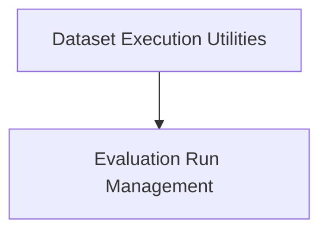

# Dataset Runner Module Documentation

## Introduction

The `dataset_runner` module is a core component within the LangChain Smith evaluation framework, designed to facilitate the execution of language models (LLMs) or chains against specified datasets. It provides robust mechanisms for running evaluations, collecting metrics, and managing the state of evaluation runs, supporting both synchronous and asynchronous operations.

This module is crucial for quantitatively assessing the performance of LLMs and chains, enabling developers to track and compare different revisions of their systems. It integrates with LangSmith for logging traces, feedback, and managing project metadata.

## Architecture Overview

The `dataset_runner` module is composed of two primary sub-modules:

1.  **Evaluation Run Management**: Responsible for setting up, managing the state, and finalizing evaluation runs.
2.  **Dataset Execution Utilities**: Handles the actual synchronous and asynchronous execution of LLMs or chains on individual examples within a dataset.

These sub-modules work in concert to provide a comprehensive evaluation pipeline. The `Evaluation Run Management` module prepares the necessary configurations and gathers results, while the `Dataset Execution Utilities` module performs the core task of interacting with the LLM/chain.

<!-- DIAGRAM_JSON
{
    "direction": "TD",
    "nodes": [
        {"id": "evaluation_run_management", "label": "Evaluation Run Management", "type": "module", "link": "evaluation_run_management.md"},
        {"id": "dataset_execution_utilities", "label": "Dataset Execution Utilities", "type": "module", "link": "dataset_execution_utilities.md"}
    ],
    "edges": [
        {"source": "dataset_execution_utilities", "target": "evaluation_run_management"}
    ],
    "groups": []
}
-->

## Sub-modules

### [Evaluation Run Management](evaluation_run_management.md)

This sub-module, primarily through the `_DatasetRunContainer` component, is responsible for initializing and orchestrating the entire evaluation process. It sets up the LangSmith client, project, dataset, and evaluators. It also manages the collection of metrics and feedback throughout the run and finalizes the project upon completion.

### [Dataset Execution Utilities](dataset_execution_utilities.md)

This sub-module provides the core functionality for running language models or chains against individual examples in a dataset. It includes both synchronous (`run_on_dataset`) and asynchronous (`arun_on_dataset`, `_arun_llm_or_chain`) methods, ensuring efficient processing of evaluation tasks. It integrates with the `Evaluation Run Management` to utilize the prepared configurations and log results.