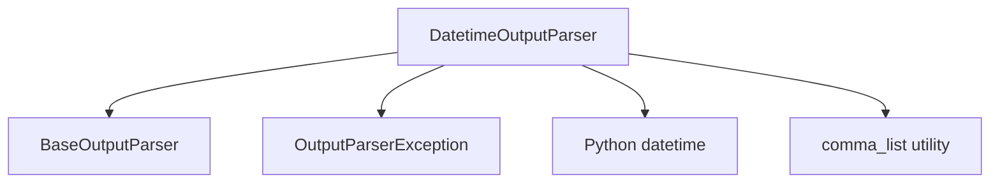

# datetime_parser Module Documentation

## Introduction
The `datetime_parser` module provides a specialized output parser for converting LLM-generated strings into `datetime` objects. This module is essential for applications that require precise date and time information extracted from language model outputs, ensuring that temporal data is correctly formatted and usable within the system.

## Module Architecture and Component Relationships

<!-- DIAGRAM_JSON
{
    "direction": "TD",
    "nodes": [
        {"id": "datetime_output_parser", "label": "DatetimeOutputParser", "type": "component", "link": null},
        {"id": "base_output_parser", "label": "BaseOutputParser", "type": "external", "link": "classic_output_parsers.md"},
        {"id": "output_parser_exception", "label": "OutputParserException", "type": "external", "link": "classic_output_parsers.md"},
        {"id": "datetime_module", "label": "Python datetime", "type": "external", "link": null},
        {"id": "comma_list_utility", "label": "comma_list utility", "type": "external", "link": "core_utils.md"}
    ],
    "edges": [
        {"source": "datetime_output_parser", "target": "base_output_parser"},
        {"source": "datetime_output_parser", "target": "output_parser_exception"},
        {"source": "datetime_output_parser", "target": "datetime_module"},
        {"source": "datetime_output_parser", "target": "comma_list_utility"}
    ],
    "groups": []
}
-->



## Core Components

### `DatetimeOutputParser`
`DatetimeOutputParser` is the primary class in this module, inheriting from `BaseOutputParser`. Its main responsibility is to parse a string generated by a large language model into a `datetime` object.

**Key Features:**
-   **Configurable Format**: The `format` attribute (`str`) allows developers to specify the exact datetime string pattern expected from the LLM. The default format is `"%Y-%m-%dT%H:%M:%S.%fZ"` (ISO 8601 with microseconds and 'Z' for UTC).
-   **Format Instructions Generation**: The `get_format_instructions()` method dynamically generates clear instructions for the LLM, including examples based on the configured `format`, to guide the model in producing correctly formatted datetime strings. This enhances the reliability of the parsing process.
-   **Robust Parsing**: The `parse()` method attempts to convert the input string using `datetime.strptime()` and raises an `OutputParserException` if the string does not conform to the specified format, providing informative error messages.

**Usage:**

```python
from datetime import datetime
from langchain_classic.output_parsers.datetime import DatetimeOutputParser
from langchain_core.exceptions import OutputParserException # Assuming this path for the example

# Initialize the parser with the default format
parser = DatetimeOutputParser()

# Get format instructions for the LLM
instructions = parser.get_format_instructions()
print(f"Instructions for LLM:
{instructions}")

# Example LLM output
llm_output = "2023-10-27T10:00:00.000000Z"
parsed_datetime = parser.parse(llm_output)
print(f"Parsed datetime: {parsed_datetime} (Type: {type(parsed_datetime)})")

# Example with a custom format
custom_parser = DatetimeOutputParser(format="%m-%d-%Y %H:%M:%S")
custom_llm_output = "10-27-2023 10:00:00"
parsed_custom_datetime = custom_parser.parse(custom_llm_output)
print(f"Parsed custom datetime: {parsed_custom_datetime}")

# Example of incorrect format (will raise an exception)
try:
    parser.parse("invalid-date-string")
except OutputParserException as e:
    print(f"Error parsing datetime: {e}")
```

## How it Fits into the Overall System
The `datetime_parser` module is a crucial utility within the `classic_output_parsers` ecosystem, specifically designed for handling datetime-related outputs from Large Language Models.

-   **Integration with LLM Chains**: This parser is typically used as a step in a larger LLM chain or agent, where an LLM is prompted to generate a datetime string. After the LLM's response, the `DatetimeOutputParser` is invoked to reliably convert this string into a structured `datetime` object.
-   **Dependency on Base Output Parsers**: It extends `BaseOutputParser` (defined in [classic_output_parsers.md](classic_output_parsers.md)), adhering to the standard interface for output parsers in the system. This allows for seamless integration with other components that expect a `BaseOutputParser` instance.
-   **Error Handling**: By raising `OutputParserException` (also likely defined or re-exported from [classic_output_parsers.md](classic_output_parsers.md)), it provides a standardized way to signal parsing failures, enabling higher-level components to gracefully handle invalid LLM outputs.
-   **Utility Dependency**: It leverages helper functions like `comma_list` (potentially from [core_utils.md](core_utils.md)) to generate user-friendly format examples.
-   **Application**: This module is vital for any application requiring structured temporal data from LLMs, such as scheduling, event management, data logging with timestamps, or any other time-sensitive processing.

This module contributes to making LLM interactions more robust and their outputs more actionable by transforming free-form text into structured data types.