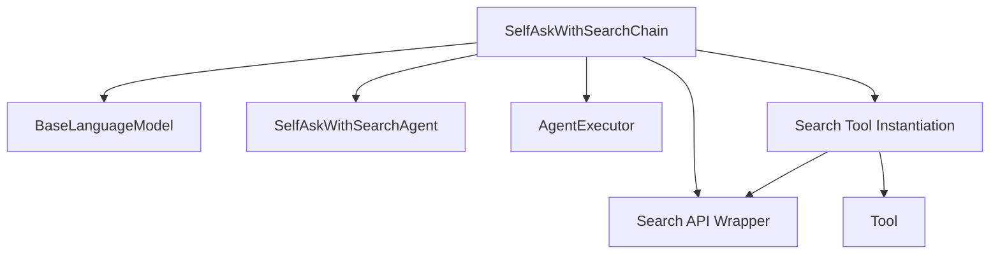

# deprecated_agent_chain Module Documentation

## Introduction

This module defines the `SelfAskWithSearchChain`, a deprecated component that orchestrates a "self-ask with search" agent. This chain integrates a language model with a search tool to iteratively answer questions by posing sub-questions and searching for intermediate answers.

**Note: This module is deprecated. Developers are encouraged to explore newer agent implementations within the LangChain framework.**

## Architecture and Core Functionality

The `deprecated_agent_chain` module primarily exposes the `SelfAskWithSearchChain` class. This class is built upon the `AgentExecutor` and leverages a `SelfAskWithSearchAgent` to facilitate a thinking process that involves querying a search engine for information.

### SelfAskWithSearchChain

- **Purpose:** Implements the "self-ask with search" paradigm, allowing an agent to break down a complex query into smaller search-friendly questions and use a search tool to find answers.
- **Inheritance:** Extends `AgentExecutor`, inheriting its capabilities for running agents with a set of tools.
- **Initialization:** Requires a `BaseLanguageModel` (LLM) and a `search_chain` (which can be `GoogleSerperAPIWrapper`, `SearchApiAPIWrapper`, or `SerpAPIWrapper`).
- **Internal Components:**
    - **Search Tool Creation:** Internally creates a `Tool` instance named "Intermediate Answer" using the provided `search_chain`. This tool's `func` and `coroutine` methods are directly linked to the `run` and `arun` methods of the `search_chain`, respectively.
    - **Agent Instantiation:** Initializes a `SelfAskWithSearchAgent` using the provided `llm` and the newly created search `Tool`.

## Module Relationships

The `deprecated_agent_chain` module, through `SelfAskWithSearchChain`, has several key dependencies:

- **[Core Language Models](core_language_models.md):** The `SelfAskWithSearchChain` depends on a `BaseLanguageModel` to power its reasoning capabilities.
- **[Core Tools](core_tools.md):** It utilizes the `Tool` class to encapsulate the search functionality, making it accessible to the agent.
- **[Self Ask With Search Agents](agent_class_definition.md):** It relies on the `SelfAskWithSearchAgent` for the core logic of the self-ask process.
- **[Classic Agents](classic_agents.md):** `SelfAskWithSearchChain` inherits from `AgentExecutor`, which is a fundamental component of the classic agents framework.
- **Search API Wrappers:** The module directly integrates with external search API wrappers (e.g., `GoogleSerperAPIWrapper`, `SearchApiAPIWrapper`, `SerpAPIWrapper`) to perform web searches.

<!-- DIAGRAM_JSON
{
    "direction": "TD",
    "nodes": [
        {"id": "self_ask_with_search_chain", "label": "SelfAskWithSearchChain", "type": "component", "link": null},
        {"id": "llm_base_model", "label": "BaseLanguageModel", "type": "external", "link": "core_language_models.md"},
        {"id": "search_wrapper", "label": "Search API Wrapper", "type": "external", "link": null},
        {"id": "self_ask_agent", "label": "SelfAskWithSearchAgent", "type": "external", "link": "agent_class_definition.md"},
        {"id": "agent_executor", "label": "AgentExecutor", "type": "external", "link": "classic_agents.md"},
        {"id": "tool_component", "label": "Tool", "type": "external", "link": "core_tools.md"},
        {"id": "search_tool_instantiation", "label": "Search Tool Instantiation", "type": "component", "link": null}
    ],
    "edges": [
        {"source": "self_ask_with_search_chain", "target": "llm_base_model"},
        {"source": "self_ask_with_search_chain", "target": "search_wrapper"},
        {"source": "self_ask_with_search_chain", "target": "search_tool_instantiation"},
        {"source": "search_tool_instantiation", "target": "tool_component"},
        {"source": "search_tool_instantiation", "target": "search_wrapper"},
        {"source": "self_ask_with_search_chain", "target": "self_ask_agent"},
        {"source": "self_ask_with_search_chain", "target": "agent_executor"}
    ],
    "groups": []
}
-->
