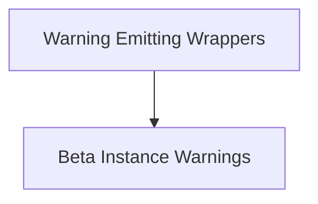

# Deprecation Warnings Module

## Introduction and Purpose

The `deprecation_warnings` module in `langchain_core` is designed to manage and issue deprecation and beta usage warnings. Its primary purpose is to inform developers when they are using parts of the library that are slated for removal, have been superseded, or are still under active development (beta features). This helps maintain backward compatibility while guiding users towards the most current and stable APIs.

## Architecture Overview

The module's architecture is centered around wrapper functions that intercept calls to potentially deprecated or beta components. These wrappers are intelligently designed to prevent redundant warnings and to differentiate between internal library usage and external user calls, ensuring warnings are only presented when relevant to the end-user.

## Sub-modules

This module is organized into the following sub-modules, each handling a specific aspect of deprecation and beta warnings:

*   **[Warning Emitting Wrappers](warning_wrappers.md)**: Contains the core logic for wrapping synchronous and asynchronous functions to emit deprecation warnings.
*   **[Beta Instance Warnings](beta_instance_warnings.md)**: Specifically handles warnings related to the direct instantiation of beta classes.

## Module Relationships

<!-- DIAGRAM_JSON
{
    "direction": "TD",
    "nodes": [
        {"id": "warning_wrappers", "label": "Warning Emitting Wrappers", "type": "module", "link": "warning_wrappers.md"},
        {"id": "beta_instance_warnings", "label": "Beta Instance Warnings", "type": "module", "link": "beta_instance_warnings.md"}
    ],
    "edges": [
        {"source": "warning_wrappers", "target": "beta_instance_warnings"}
    ],
    "groups": []
}
-->

