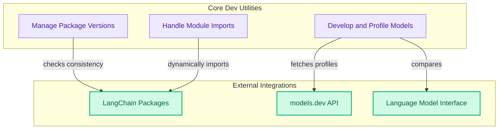

# Developer Tools
This module offers essential utilities for developers, including tools for validating package version consistency, a laboratory for experimenting with and comparing different language models, and a robust system for managing module imports with deprecation handling.

<!-- DIAGRAM_JSON
{
    "direction": "TD",
    "nodes": [
        {
            "id": "developer_tools",
            "label": "Developer Tools",
            "type": "module"
        },
        {
            "id": "version_management",
            "label": "Manage Package Versions",
            "type": "module",
            "link": "version_management.md"
        },
        {
            "id": "model_development_profiling",
            "label": "Develop and Profile Models",
            "type": "module",
            "link": "model_development_profiling.md"
        },
        {
            "id": "module_import_utility",
            "label": "Handle Module Imports",
            "type": "module",
            "link": "module_import_utility.md"
        },
        {
            "id": "langchain_packages",
            "label": "LangChain Packages",
            "type": "external"
        },
        {
            "id": "models_dev_api",
            "label": "models.dev API",
            "type": "external"
        },
        {
            "id": "language_model_interface",
            "label": "Language Model Interface",
            "type": "external",
            "link": "language_model_interface.md"
        }
    ],
    "edges": [
        {
            "source": "version_management",
            "target": "langchain_packages",
            "label": "checks consistency"
        },
        {
            "source": "model_development_profiling",
            "target": "language_model_interface",
            "label": "compares"
        },
        {
            "source": "model_development_profiling",
            "target": "models_dev_api",
            "label": "fetches profiles"
        },
        {
            "source": "module_import_utility",
            "target": "langchain_packages",
            "label": "dynamically imports"
        }
    ],
    "groups": [
        {
            "id": "core_dev_utilities",
            "label": "Core Dev Utilities",
            "role": "analytical",
            "nodes": [
                "version_management",
                "model_development_profiling",
                "module_import_utility"
            ]
        },
        {
            "id": "external_integrations",
            "label": "External Integrations",
            "role": "data",
            "nodes": [
                "langchain_packages",
                "models_dev_api",
                "language_model_interface"
            ]
        }
    ]
}
-->
