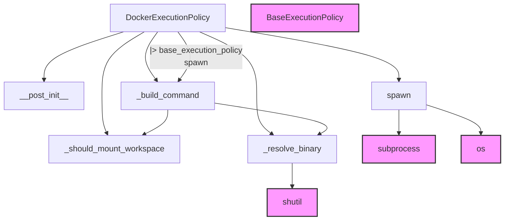

# Docker Execution Policy

The `docker_execution_policy` module is a crucial component within the `langchain_v1_agents_middleware` system, specifically designed to enhance the security and isolation of agent execution environments. It provides a robust mechanism for running arbitrary shell commands within a dedicated Docker container, thereby isolating the execution from the host system. This is particularly vital when dealing with untrusted code or when a consistent and reproducible execution environment is required across different agent sessions.

### Architecture and Component Relationships

The `docker_execution_policy` module primarily consists of the `DockerExecutionPolicy` class, which extends the `BaseExecutionPolicy` from the `execution_policies` module. This inheritance signifies its role as a concrete implementation of an execution policy.

The `DockerExecutionPolicy` class encapsulates the logic for configuring and managing Docker containers to execute shell commands. It leverages several internal methods to construct the Docker command, determine workspace mounting, and resolve the Docker binary. It interacts with the operating system and subprocess management tools to achieve its functionality.

<!-- DIAGRAM_JSON
{
    "direction": "TD",
    "nodes": [
        {"id": "docker_execution_policy", "label": "DockerExecutionPolicy", "type": "component", "link": null},
        {"id": "_post_init", "label": "__post_init__", "type": "component", "link": null},
        {"id": "spawn", "label": "spawn", "type": "component", "link": null},
        {"id": "_build_command", "label": "_build_command", "type": "component", "link": null},
        {"id": "_should_mount_workspace", "label": "_should_mount_workspace", "type": "component", "link": null},
        {"id": "_resolve_binary", "label": "_resolve_binary", "type": "component", "link": null},
        {"id": "base_execution_policy", "label": "BaseExecutionPolicy", "type": "external", "link": "execution_policies.md"},
        {"id": "subprocess_module", "label": "subprocess", "type": "external", "link": null},
        {"id": "os_module", "label": "os", "type": "external", "link": null},
        {"id": "shutil_module", "label": "shutil", "type": "external", "link": null}
    ],
    "edges": [
        {"source": "docker_execution_policy", "target": "_post_init"},
        {"source": "docker_execution_policy", "target": "spawn"},
        {"source": "docker_execution_policy", "target": "_build_command"},
        {"source": "docker_execution_policy", "target": "_should_mount_workspace"},
        {"source": "docker_execution_policy", "target": "_resolve_binary"},
        {"source": "docker_execution_policy", "target": "base_execution_policy"},
        {"source": "spawn", "target": "_build_command"},
        {"source": "spawn", "target": "subprocess_module"},
        {"source": "spawn", "target": "os_module"},
        {"source": "_build_command", "target": "_should_mount_workspace"},
        {"source": "_build_command", "target": "_resolve_binary"},
        {"source": "_resolve_binary", "target": "shutil_module"}
    ],
    "groups": []
}
-->

### Module Overview

The `DockerExecutionPolicy` class provides a robust and configurable way to execute shell commands within isolated Docker containers. It offers several parameters to control the Docker container's behavior, including network access, memory limits, CPU usage, and filesystem access (read-only rootfs).

#### Core Components

*   **`DockerExecutionPolicy`**:
    *   **Purpose**: This is the main class responsible for orchestrating the execution of shell commands within a Docker container. It inherits from `BaseExecutionPolicy`, providing a standardized interface for execution.
    *   **Key Features**:
        *   **Isolation**: Runs commands in a separate Docker container, preventing direct interaction with the host system.
        *   **Security**: By default, disables network access (`--network none`) and supports read-only root filesystems for enhanced security.
        *   **Resource Limits**: Allows setting memory and CPU limits for the container.
        *   **Customization**: Supports specifying a custom Docker image, adding extra `docker run` arguments, and controlling container removal on exit.
        *   **Workspace Mounting**: Intelligently mounts the workspace into the container if it's a persistent directory, or uses an ephemeral `/` directory for temporary sessions.
    *   **Configuration Parameters**:
        *   `binary`: The Docker CLI binary name (default: "docker").
        *   `image`: The Docker image to use for execution (default: "python:3.12-alpine3.19").
        *   `remove_container_on_exit`: If `True`, the container is removed upon exit.
        *   `network_enabled`: If `True`, the container's network namespace is enabled.
        *   `extra_run_args`: Additional arguments to pass to `docker run`.
        *   `memory_bytes`: Memory limit for the container in bytes.
        *   `cpus`: CPU quota for the container.
        *   `read_only_rootfs`: If `True`, mounts the container's root filesystem as read-only.
        *   `user`: Specifies the user to run the commands as inside the container.
    *   **Methods**:
        *   **`__post_init__`**: Performs validation of configuration parameters to ensure valid inputs.
        *   **`spawn(workspace: Path, env: Mapping[str, str], command: Sequence[str]) -> subprocess.Popen[str]`**: This is the core method that initiates the Docker container and executes the given command. It constructs the full Docker command and launches a subprocess to run it.
        *   **`_build_command(workspace: Path, env: Mapping[str, str], command: Sequence[str]) -> list[str]`**: An internal helper method that constructs the complete `docker run` command based on the policy's configuration and the provided execution context.
        *   **`_should_mount_workspace(workspace: Path) -> bool`**: A static method that determines whether the agent's workspace should be bind-mounted into the Docker container. This prevents mounting temporary directories to minimize host exposure.
        *   **`_resolve_binary() -> str`**: An internal helper method that verifies the presence of the Docker CLI binary on the system's PATH.

### Integration with the Overall System

The `docker_execution_policy` module is a specialized execution policy within the larger `langchain_v1_agents_middleware` framework. Agents requiring a secure and isolated environment for executing shell commands can be configured to use `DockerExecutionPolicy`. This module fits into the `execution_policies` sub-module, which provides various strategies for running external code.

By providing a `DockerExecutionPolicy`, the system allows developers to run agents that interact with external tools and the filesystem in a controlled and safe manner, especially when the commands might be user-generated or potentially malicious. It complements other middleware components by ensuring that the actual execution step is sandboxed, contributing to the overall stability and security of the agent system. For other execution policy options, refer to the [execution_policies](execution_policies.md) documentation.