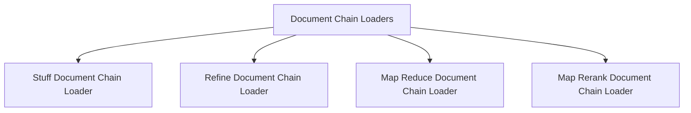

# Document Chain Loaders

The `document_chain_loaders` module, found within `langchain_classic.chains.loading`, provides a set of utility functions for constructing and loading various types of document processing chains. These chains are crucial for integrating documents with Language Models (LLMs) to perform tasks such as summarization, question answering, and information extraction. This module abstracts the complexity of instantiating these chains, allowing developers to configure them via dictionaries or file paths.

## Architecture

The `document_chain_loaders` module serves as a central point for instantiating different strategies for document handling. Each loading function (`_load_stuff_documents_chain`, `_load_refine_documents_chain`, etc.) acts as a dedicated factory for its respective chain type. These functions are responsible for parsing configuration details, loading dependent components like LLM Chains and Prompts (potentially from other modules), and assembling them into a complete document chain.

The module facilitates modularity by allowing chains and prompts to be loaded from configurations or specified paths, promoting reusability and easier management of complex setups.

<!-- DIAGRAM_JSON
{
    "direction": "TD",
    "nodes": [
        {"id": "document_chain_loaders", "label": "Document Chain Loaders", "type": "module"},
        {"id": "stuff_document_chain_loader", "label": "Stuff Document Chain Loader", "type": "module", "link": "stuff_document_chain_loader.md"},
        {"id": "refine_document_chain_loader", "label": "Refine Document Chain Loader", "type": "module", "link": "refine_document_chain_loader.md"},
        {"id": "map_reduce_document_chain_loader", "label": "Map Reduce Document Chain Loader", "type": "module", "link": "map_reduce_document_chain_loader.md"},
        {"id": "map_rerank_document_chain_loader", "label": "Map Rerank Document Chain Loader", "type": "module", "link": "map_rerank_document_chain_loader.md"}
    ],
    "edges": [
        {"source": "document_chain_loaders", "target": "stuff_document_chain_loader"},
        {"source": "document_chain_loaders", "target": "refine_document_chain_loader"},
        {"source": "document_chain_loaders", "target": "map_reduce_document_chain_loader"},
        {"source": "document_chain_loaders", "target": "map_rerank_document_chain_loader"}
    ],
    "groups": []
}
-->

## Sub-modules

This module contains several sub-modules, each responsible for loading a specific type of document chain:

*   **[Stuff Document Chain Loader](stuff_document_chain_loader.md)**: This sub-module focuses on loading the `StuffDocumentsChain`, which is designed to take all provided documents and "stuff" them into a single prompt for the LLM. This approach is suitable when the combined document content fits within the LLM's context window.

*   **[Refine Document Chain Loader](refine_document_chain_loader.md)**: This sub-module handles the loading of the `RefineDocumentsChain`. This chain works by first generating an initial answer based on one document and then iteratively refining that answer by processing subsequent documents. It's useful for longer documents or collections where a single pass isn't feasible.

*   **[Map Reduce Document Chain Loader](map_reduce_document_chain_loader.md)**: This sub-module is responsible for loading the `MapReduceDocumentsChain`. This chain first processes each document independently (the "map" step) to generate a summary or initial answer. Then, it combines these individual outputs and processes them further (the "reduce" step) to produce a final, comprehensive answer. It's ideal for very large document sets.

*   **[Map Rerank Document Chain Loader](map_rerank_document_chain_loader.md)**: This sub-module loads the `MapRerankDocumentsChain`. This chain processes each document with an LLM to generate an answer and a confidence score. These answers are then reranked based on their scores, and the highest-scoring answer is returned. This is useful for tasks where the most relevant single piece of information needs to be identified from a collection.