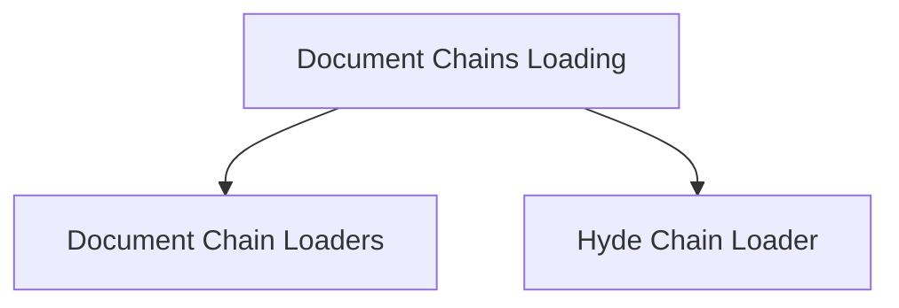

# Document Chains Loading Module

The `document_chains_loading` module in `langchain_classic.chains.loading` is responsible for providing utilities to dynamically load various types of document processing chains from configurations. These chains are fundamental components for integrating language models with documents, enabling tasks such as question answering, summarization, and advanced retrieval augmented generation (RAG) strategies.

## Architecture Overview

This module orchestrates the loading of different document chain implementations. It is structured to allow flexible instantiation of chains based on their configuration, abstracting away the underlying construction logic.

<!-- DIAGRAM_JSON
{
    "direction": "TD",
    "nodes": [
        {"id": "document_chains_loading_module", "label": "Document Chains Loading", "type": "module"},
        {"id": "document_chain_loaders", "label": "Document Chain Loaders", "type": "module", "link": "document_chain_loaders.md"},
        {"id": "hyde_chain_loader", "label": "Hyde Chain Loader", "type": "module", "link": "hyde_chain_loader.md"}
    ],
    "edges": [
        {"source": "document_chains_loading_module", "target": "document_chain_loaders"},
        {"source": "document_chains_loading_module", "target": "hyde_chain_loader"}
    ],
    "groups": []
}
-->

## Sub-modules

### [Document Chain Loaders](document_chain_loaders.md)
This sub-module contains functions to load different document processing chains such as the `StuffDocumentsChain`, `RefineDocumentsChain`, `MapReduceDocumentsChain`, and `MapRerankDocumentsChain` from configuration. Each function handles the parsing of configuration to instantiate the respective chain, often requiring `LLMChain` and `Prompt` components.

### [Hyde Chain Loader](hyde_chain_loader.md)
This sub-module provides the `_load_hyde_chain` function, which is responsible for loading the `HypotheticalDocumentEmbedder` chain. This chain is used for generating hypothetical documents for embedding, often enhancing retrieval augmented generation. It requires an `LLMChain` and `embeddings` to be provided in the configuration.
