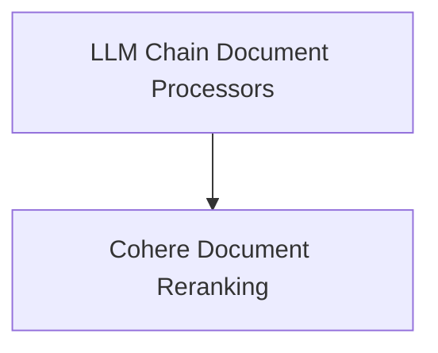

# Document Compressors Module

The `document_compressors` module provides various strategies for processing and refining documents retrieved by a retriever, making them more concise and relevant before being passed to a language model or other downstream components. This is crucial for optimizing performance, reducing token usage, and improving the quality of responses by focusing on the most pertinent information.

## Architecture Overview

The module is composed of several sub-modules, each implementing a specific document compression or filtering technique. The current architecture supports LLM-based extraction and filtering, as well as external API-based reranking.

<!-- DIAGRAM_JSON
{
    "direction": "TD",
    "nodes": [
        {"id": "llm_chain_compressors", "label": "LLM Chain Document Processors", "type": "module", "link": "llm_chain_compressors.md"},
        {"id": "cohere_reranker", "label": "Cohere Document Reranking", "type": "module", "link": "cohere_reranker.md"}
    ],
    "edges": [
        {"source": "llm_chain_compressors", "target": "cohere_reranker", "label": "Can precede"}
    ],
    "groups": []
}
-->

## Sub-modules

### [LLM Chain Document Processors](llm_chain_compressors.md)
This sub-module provides document compression and filtering capabilities using Language Model (LLM) chains to extract or filter relevant document parts based on a query.

### [Cohere Document Reranking](cohere_reranker.md)
This sub-module integrates with the Cohere Rerank API to reorder documents by their relevance to a given query, enhancing retrieval accuracy.
