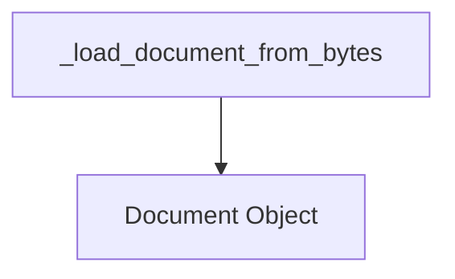

# document_deserialization Module Documentation

## Introduction

The `document_deserialization` module is responsible for deserializing `Document` objects from a bytes representation. It provides core functionality for reconstructing `Document` instances that have been previously serialized, ensuring data integrity and type correctness.

## Architecture and Component Relationships

The `document_deserialization` module contains the `_load_document_from_bytes` function, which is the primary component for handling the deserialization process. This module directly depends on the `Document` object definition, which is a fundamental data structure within the system.

<!-- DIAGRAM_JSON
{
    "direction": "TD",
    "nodes": [
        {"id": "load_document_from_bytes", "label": "_load_document_from_bytes", "type": "component", "link": null},
        {"id": "document_object", "label": "Document Object", "type": "external", "link": "core_document_loaders.md"}
    ],
    "edges": [
        {"source": "load_document_from_bytes", "target": "document_object"}
    ],
    "groups": []
}
-->

## Core Functionality

### `_load_document_from_bytes(serialized: bytes) -> Document`

This function takes a bytes object, which is expected to be a UTF-8 encoded JSON string representation of a `Document` object, and deserializes it back into a `Document` instance.

**Parameters:**

*   `serialized` (`bytes`): The bytes representation of the serialized `Document`.

**Returns:**

*   `Document`: The deserialized `Document` object.

**Raises:**

*   `TypeError`: If the deserialized object is not an instance of `Document`.

**Detailed Description:**

The function first decodes the input `bytes` into a UTF-8 string. It then uses the `json.loads` function to parse the JSON string into a Python object. A crucial step involves validating the type of the deserialized object. If the object is not an instance of `Document`, a `TypeError` is raised, ensuring that only valid `Document` objects are returned by this function. This strict type checking prevents potential issues further down the line in modules that consume `Document` objects.

## How the Module Fits into the Overall System

The `document_deserialization` module plays a vital role in the `classic_storage` component, specifically within the `data_deserialization` sub-module. It is essential for reconstructing `Document` objects that have been persisted or transmitted as bytes. This enables seamless loading of documents, which might be used by various other modules such as `core_document_loaders`, `classic_chains_qa_with_sources`, or any module that requires working with `Document` instances. By providing a reliable method for deserializing documents, this module supports the overall system's ability to manage and process document-based information effectively. Its counterpart, `data_serialization`, handles the conversion of `Document` objects into a storable format.