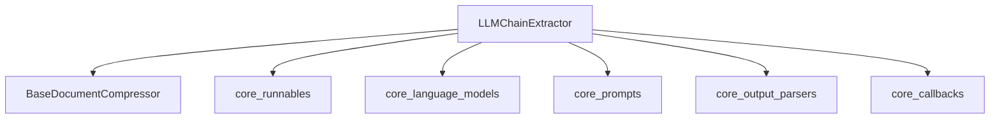

# Document Extraction Module

## Introduction

The `document_extraction` module provides a powerful mechanism for compressing and extracting relevant information from documents using Language Model (LLM) chains. Its primary component, `LLMChainExtractor`, acts as a document compressor that leverages the capabilities of LLMs to distill key content based on a given query.

## Architecture and Component Relationships

The `document_extraction` module is a leaf module within the `classic_retrievers.document_compressors.llm_chain_compressors` hierarchy. Its core functionality is encapsulated within the `LLMChainExtractor` class, which orchestrates interactions with various core components of the system to achieve document compression.

<!-- DIAGRAM_JSON
{
    "direction": "TD",
    "nodes": [
        {"id": "llm_chain_extractor", "label": "LLMChainExtractor", "type": "component", "link": null},
        {"id": "base_document_compressor", "label": "BaseDocumentCompressor", "type": "external", "link": "document_compressors.md"},
        {"id": "core_runnables", "label": "core_runnables", "type": "external", "link": "core_runnables.md"},
        {"id": "core_language_models", "label": "core_language_models", "type": "external", "link": "core_language_models.md"},
        {"id": "core_prompts", "label": "core_prompts", "type": "external", "link": "core_prompts.md"},
        {"id": "core_output_parsers", "label": "core_output_parsers", "type": "external", "link": "core_output_parsers.md"},
        {"id": "core_callbacks", "label": "core_callbacks", "type": "external", "link": "core_callbacks.md"}
    ],
    "edges": [
        {"source": "llm_chain_extractor", "target": "base_document_compressor"},
        {"source": "llm_chain_extractor", "target": "core_runnables"},
        {"source": "llm_chain_extractor", "target": "core_language_models"},
        {"source": "llm_chain_extractor", "target": "core_prompts"},
        {"source": "llm_chain_extractor", "target": "core_output_parsers"},
        {"source": "llm_chain_extractor", "target": "core_callbacks"}
    ],
    "groups": []
}
-->

### `LLMChainExtractor`

**Purpose:**
The `LLMChainExtractor` class is responsible for compressing documents by extracting relevant information using an underlying LLM chain. It processes a sequence of documents and a query, then uses the LLM chain to identify and return the most pertinent content.

**Key Attributes:**
- `llm_chain`: A `Runnable` object that represents the LLM chain used for extraction. This allows for flexible integration with various language models and processing steps.
- `get_input`: A callable function that constructs the input dictionary for the `llm_chain` from the provided query and document.

**Core Methods:**
- `compress_documents(documents: Sequence[Document], query: str, callbacks: Callbacks | None = None) -> Sequence[Document]`:
  This method performs synchronous document compression. It iterates through the input `documents`, generates input for the `llm_chain` using `get_input`, invokes the chain, and processes its output. The extracted content is then used to create new `Document` objects, preserving the original metadata.
- `acompress_documents(documents: Sequence[Document], query: str, callbacks: Callbacks | None = None) -> Sequence[Document]`:
  An asynchronous version of `compress_documents`, this method leverages the `abatch` functionality of `llm_chain` to compress documents concurrently, improving performance for large sets of documents.
- `from_llm(cls, llm: BaseLanguageModel, prompt: PromptTemplate | None = None, get_input: Callable[[str, Document], str] | None = None, llm_chain_kwargs: dict | None = None) -> LLMChainExtractor`:
  A class method that provides a convenient way to initialize an `LLMChainExtractor` from a `BaseLanguageModel` and an optional `PromptTemplate`. It constructs the `llm_chain` by chaining the prompt, LLM, and an output parser (defaulting to `StrOutputParser` if none is specified in the prompt).

## How the Module Fits into the Overall System

The `document_extraction` module plays a crucial role within the broader document compression framework. It provides a concrete implementation of `BaseDocumentCompressor` which is likely part of the `document_compressors` module (see [document_compressors.md](document_compressors.md)). This allows other components, such as retrievers, to integrate LLM-powered content extraction capabilities seamlessly.

By depending on core modules like [core_runnables.md](core_runnables.md), [core_language_models.md](core_language_models.md), [core_prompts.md](core_prompts.md), [core_output_parsers.md](core_output_parsers.md), and [core_callbacks.md](core_callbacks.md), `document_extraction` ensures interoperability and leverages the foundational functionalities of the system. This modular design allows for flexible swapping of LLMs, prompt templates, and output parsers, making the extraction process highly customizable and adaptable to various use cases.