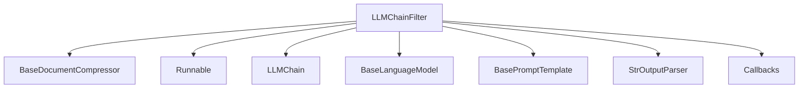

# Document Filtering Module

## Introduction
The `document_filtering` module, located within `langchain_classic.retrievers.document_compressors`, provides functionality for selectively filtering documents based on their relevance to a given query. This module is crucial for improving the efficiency and accuracy of retrieval systems by ensuring that only pertinent documents are passed on for further processing.

## Core Functionality
The primary purpose of this module is to implement a document compressor that uses a Language Model (LLM) chain to determine the relevance of documents. It helps to prune irrelevant documents, thereby reducing noise and computational overhead in information retrieval tasks.

## Architecture and Component Relationships

<!-- DIAGRAM_JSON
{
    "direction": "TD",
    "nodes": [
        {"id": "llm_chain_filter", "label": "LLMChainFilter", "type": "component", "link": null},
        {"id": "base_document_compressor", "label": "BaseDocumentCompressor", "type": "external", "link": "classic_retrievers_document_compressors.md"},
        {"id": "runnable", "label": "Runnable", "type": "external", "link": "core_runnables.md"},
        {"id": "llm_chain", "label": "LLMChain", "type": "external", "link": "classic_chains_base.md"},
        {"id": "base_language_model", "label": "BaseLanguageModel", "type": "external", "link": "core_language_models.md"},
        {"id": "base_prompt_template", "label": "BasePromptTemplate", "type": "external", "link": "core_prompts.md"},
        {"id": "str_output_parser", "label": "StrOutputParser", "type": "external", "link": "core_output_parsers.md"},
        {"id": "callbacks", "label": "Callbacks", "type": "external", "link": "core_callbacks.md"}
    ],
    "edges": [
        {"source": "llm_chain_filter", "target": "base_document_compressor"},
        {"source": "llm_chain_filter", "target": "runnable"},
        {"source": "llm_chain_filter", "target": "llm_chain"},
        {"source": "llm_chain_filter", "target": "base_language_model"},
        {"source": "llm_chain_filter", "target": "base_prompt_template"},
        {"source": "llm_chain_filter", "target": "str_output_parser"},
        {"source": "llm_chain_filter", "target": "callbacks"}
    ],
    "groups": []
}
-->

### LLMChainFilter
The `LLMChainFilter` is the core component of this module. It inherits from `BaseDocumentCompressor` and implements methods to filter a sequence of documents based on their relevance to a given query.

- **`llm_chain`**: A `Runnable` instance that encapsulates the LLM used for making filtering decisions. This chain is expected to output a boolean value (or a string that can be parsed to a boolean) indicating whether a document should be included.
- **`get_input`**: A callable that constructs the input dictionary for the `llm_chain` from the query and a document.
- **`compress_documents` / `acompress_documents`**: These methods iterate through a list of documents, construct inputs for the `llm_chain`, and then filter documents based on the boolean output of the chain.
- **`from_llm`**: A class method that provides a convenient way to instantiate `LLMChainFilter` directly from a `BaseLanguageModel` and an optional `BasePromptTemplate`. It automatically sets up the `llm_chain` with a default `StrOutputParser` if no output parser is specified in the prompt.

## System Integration
The `document_filtering` module integrates into the larger system as a specialized document compressor. It can be used in various retrieval pipelines where reducing the number of irrelevant documents is beneficial. By leveraging LLMs, it provides an intelligent way to filter content, enhancing the quality and relevance of information passed to subsequent stages of a system. It depends on core components such as `Runnable` for its execution model, `BaseLanguageModel` and `BasePromptTemplate` for defining the LLM filtering logic, and `StrOutputParser` for interpreting the LLM's output. Its integration point is typically within a larger retrieval or RAG (Retrieval Augmented Generation) system, where it acts as a pre-processing step before documents are used for generation or further analysis.
