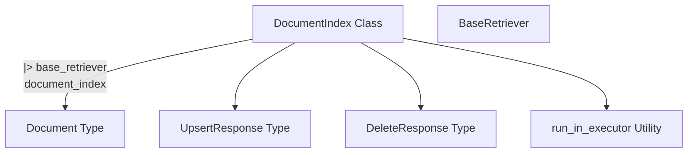

# Document Index Interface

The `document_index_interface` module provides a foundational abstract interface for document indexing operations. It defines a generic contract for storing, retrieving, and managing documents identified by unique IDs, forming a crucial part of the overall document management and retrieval system.

## Purpose and Core Functionality

This module's primary purpose is to offer a consistent and flexible interface for various document indexing implementations. By abstracting the underlying storage and querying mechanisms, it allows for interchangeable backends while maintaining a unified API for developers. Its core functionalities include:

*   **Upserting Documents**: Adding new documents or updating existing ones based on their unique identifiers. If an ID is not provided, the implementation can generate one.
*   **Deleting Documents**: Removing documents from the index, either by a list of specific IDs or by other implementation-specific criteria.
*   **Retrieving Documents**: Fetching documents by their unique IDs.

## Architecture and Component Relationships

The `document_index_interface` module centers around the `DocumentIndex` abstract base class, which establishes the blueprint for any concrete document indexing system. It extends the functionality of `BaseRetriever`, indicating its role in document retrieval.

<!-- DIAGRAM_JSON
{
    "direction": "TD",
    "nodes": [
        {"id": "document_index", "label": "DocumentIndex Class", "type": "component", "link": null},
        {"id": "base_retriever", "label": "BaseRetriever", "type": "external", "link": "core_retrievers.md"},
        {"id": "document", "label": "Document Type", "type": "external", "link": "core_api.md"},
        {"id": "upsert_response", "label": "UpsertResponse Type", "type": "external", "link": "core_indexing.md"},
        {"id": "delete_response", "label": "DeleteResponse Type", "type": "external", "link": "core_indexing.md"},
        {"id": "run_in_executor", "label": "run_in_executor Utility", "type": "external", "link": "core_utils.md"}
    ],
    "edges": [
        {"source": "document_index", "target": "base_retriever", "label": "inherits"},
        {"source": "document_index", "target": "document", "label": "uses"},
        {"source": "document_index", "target": "upsert_response", "label": "returns"},
        {"source": "document_index", "target": "delete_response", "label": "returns"},
        {"source": "document_index", "target": "run_in_executor", "label": "uses"}
    ],
    "groups": []
}
-->

### Key Components

#### `DocumentIndex`

`DocumentIndex` is an abstract base class that defines the contract for any document indexing system. It inherits from `BaseRetriever` from the [core_retrievers module](core_retrievers.md), indicating its capability to retrieve documents. Implementations of this class must provide concrete logic for the following methods:

*   **`upsert(items: Sequence[Document], /, **kwargs: Any) -> UpsertResponse`**:
    This method is responsible for adding new documents or updating existing ones. It takes a sequence of `Document` objects (defined in [core_api.md](core_api.md)). If a document's ID is provided, it updates the corresponding entry; otherwise, it can generate a new ID. It returns an `UpsertResponse` (defined in [core_indexing.md](core_indexing.md)) indicating success or failure for each document.

*   **`aupsert(items: Sequence[Document], /, **kwargs: Any) -> UpsertResponse`**:
    The asynchronous counterpart to `upsert`, leveraging `run_in_executor` from [core_utils.md](core_utils.md) for non-blocking operations.

*   **`delete(ids: list[str] | None = None, **kwargs: Any) -> DeleteResponse`**:
    Deletes documents from the index based on a list of provided IDs. Calling this method without any parameters should raise a `ValueError`. It returns a `DeleteResponse` (defined in [core_indexing.md](core_indexing.md)).

*   **`adelete(ids: list[str] | None = None, **kwargs: Any) -> DeleteResponse`**:
    The asynchronous counterpart to `delete`, also utilizing `run_in_executor`.

*   **`get(ids: Sequence[str], /, **kwargs: Any) -> list[Document]`**:
    Retrieves documents by their IDs. It may return fewer documents than requested if some IDs are not found. The order of returned documents is not guaranteed to match the input order. This method should not raise exceptions if documents are not found.

*   **`aget(ids: Sequence[str], /, **kwargs: Any) -> list[Document]`**:
    The asynchronous counterpart to `get`, implemented using `run_in_executor`.

## Integration with Other Modules

The `document_index_interface` module serves as a critical abstraction within the `core_indexing` subsystem. Concrete implementations, such as `in_memory_index_implementation`, will adhere to this interface, providing different ways to store and query documents. It acts as a bridge between high-level operations that need to interact with indexed documents and the specific storage mechanisms. Modules like `core_retrievers` can leverage this interface to fetch documents, while components handling document loading (e.g., from [core_document_loaders.md](core_document_loaders.md)) would feed documents into implementations of this interface. The underlying `Document` type is a fundamental data structure likely defined within [core_api.md](core_api.md).