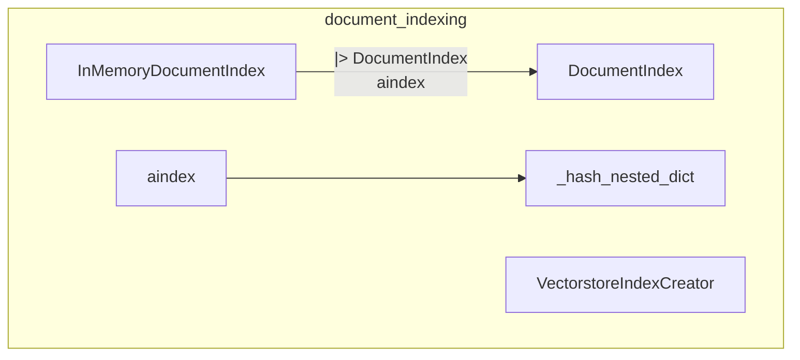

# document_indexing module
This module provides core functionalities for indexing documents, including an abstract base class for document indexes, an in-memory implementation, and an asynchronous indexing API.

<!-- DIAGRAM_JSON
{
    "nodes": [
        {
            "id": "aindex",
            "label": "aindex",
            "type": "function"
        },
        {
            "id": "_hash_nested_dict",
            "label": "_hash_nested_dict",
            "type": "function"
        },
        {
            "id": "DocumentIndex",
            "label": "DocumentIndex",
            "type": "class"
        },
        {
            "id": "InMemoryDocumentIndex",
            "label": "InMemoryDocumentIndex",
            "type": "class"
        },
        {
            "id": "VectorstoreIndexCreator",
            "label": "VectorstoreIndexCreator",
            "type": "class"
        }
    ],
    "edges": [
        {
            "source": "InMemoryDocumentIndex",
            "target": "DocumentIndex",
            "type": "inherits"
        },
        {
            "source": "aindex",
            "target": "DocumentIndex",
            "type": "uses"
        },
        {
            "source": "aindex",
            "target": "_hash_nested_dict",
            "type": "uses"
        }
    ],
    "groups": []
}
-->
