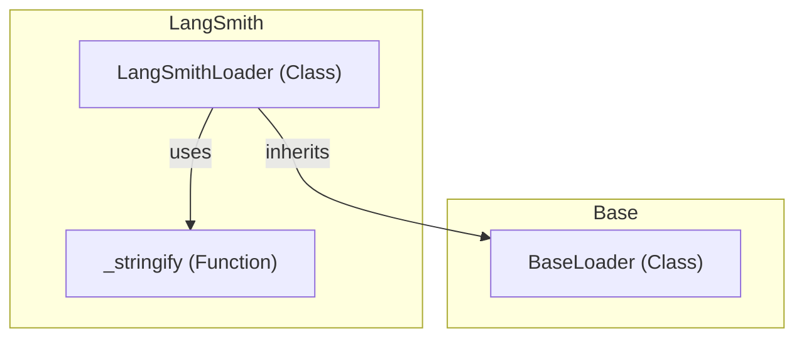

# document_loaders
This module provides interfaces and implementations for loading documents from various sources, including a base loader and a specific loader for LangSmith datasets.

<!-- DIAGRAM_JSON
{
  "nodes": [
    {
      "id": "BaseLoader",
      "label": "BaseLoader",
      "type": "class"
    },
    {
      "id": "_stringify",
      "label": "_stringify",
      "type": "function"
    },
    {
      "id": "LangSmithLoader",
      "label": "LangSmithLoader",
      "type": "class"
    }
  ],
  "edges": [
    {
      "source": "LangSmithLoader",
      "target": "BaseLoader",
      "label": "inherits"
    },
    {
      "source": "LangSmithLoader",
      "target": "_stringify",
      "label": "uses"
    }
  ],
  "groups": [
    {
      "id": "Base",
      "label": "Base",
      "nodes": ["BaseLoader"]
    },
    {
      "id": "LangSmith",
      "label": "LangSmith",
      "nodes": ["LangSmithLoader", "_stringify"]
    }
  ]
}
-->
