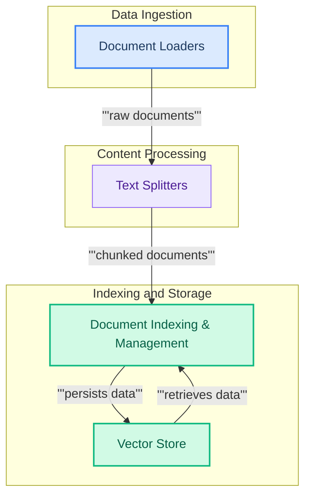

# Document Management

This module provides comprehensive functionalities for loading, splitting, indexing, and managing documents, enabling efficient data preparation and organization for various language model applications.

<!-- DIAGRAM_JSON
{
    "direction": "TD",
    "nodes": [
        {
            "id": "document_management",
            "label": "Document Management",
            "type": "module"
        },
        {
            "id": "document_loaders",
            "label": "Document Loaders",
            "type": "module",
            "link": "document_loaders.md"
        },
        {
            "id": "text_splitters",
            "label": "Text Splitters",
            "type": "module",
            "link": "text_splitters.md"
        },
        {
            "id": "document_indexing",
            "label": "Document Indexing & Management",
            "type": "module",
            "link": "document_indexing.md"
        },
        {
            "id": "vector_store",
            "label": "Vector Store",
            "type": "external"
        }
    ],
    "edges": [
        {
            "source": "document_loaders",
            "target": "text_splitters",
            "label": "raw documents"
        },
        {
            "source": "text_splitters",
            "target": "document_indexing",
            "label": "chunked documents"
        },
        {
            "source": "document_indexing",
            "target": "vector_store",
            "label": "persists data"
        },
        {
            "source": "vector_store",
            "target": "document_indexing",
            "label": "retrieves data"
        }
    ],
    "groups": [
        {
            "id": "data_ingestion",
            "label": "Data Ingestion",
            "role": "surface",
            "nodes": [
                "document_loaders"
            ]
        },
        {
            "id": "content_processing",
            "label": "Content Processing",
            "role": "analytical",
            "nodes": [
                "text_splitters"
            ]
        },
        {
            "id": "indexing_storage",
            "label": "Indexing and Storage",
            "role": "data",
            "nodes": [
                "document_indexing",
                "vector_store"
            ]
        }
    ]
}
-->
