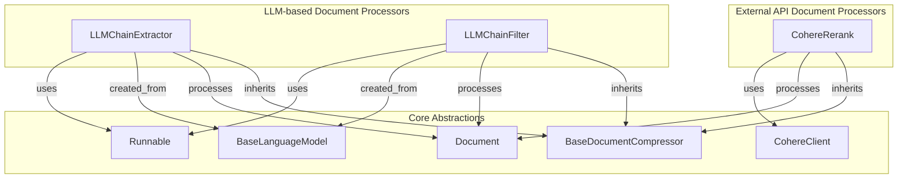

# document_post_processing
This module provides tools for post-processing documents, including extraction of relevant parts, filtering based on relevance, and reranking using external services. It enhances document retrieval and preparation for further use.

<!-- DIAGRAM_JSON
{
  "nodes": [
    {"id": "LLMChainExtractor", "label": "LLMChainExtractor"},
    {"id": "LLMChainFilter", "label": "LLMChainFilter"},
    {"id": "CohereRerank", "label": "CohereRerank"},
    {"id": "Runnable", "label": "Runnable"},
    {"id": "BaseLanguageModel", "label": "BaseLanguageModel"},
    {"id": "CohereClient", "label": "Cohere Client"},
    {"id": "Document", "label": "Document"},
    {"id": "BaseDocumentCompressor", "label": "BaseDocumentCompressor"}
  ],
  "edges": [
    {"source": "LLMChainExtractor", "target": "Runnable", "label": "uses"},
    {"source": "LLMChainFilter", "target": "Runnable", "label": "uses"},
    {"source": "LLMChainExtractor", "target": "BaseLanguageModel", "label": "created_from"},
    {"source": "LLMChainFilter", "target": "BaseLanguageModel", "label": "created_from"},
    {"source": "CohereRerank", "target": "CohereClient", "label": "uses"},
    {"source": "LLMChainExtractor", "target": "Document", "label": "processes"},
    {"source": "LLMChainFilter", "target": "Document", "label": "processes"},
    {"source": "CohereRerank", "target": "Document", "label": "processes"},
    {"source": "LLMChainExtractor", "target": "BaseDocumentCompressor", "label": "inherits"},
    {"source": "LLMChainFilter", "target": "BaseDocumentCompressor", "label": "inherits"},
    {"source": "CohereRerank", "target": "BaseDocumentCompressor", "label": "inherits"}
  ],
  "groups": [
    {"id": "llm_processors", "label": "LLM-based Document Processors", "nodes": ["LLMChainExtractor", "LLMChainFilter"]},
    {"id": "external_api_processors", "label": "External API Document Processors", "nodes": ["CohereRerank"]},
    {"id": "core_abstractions", "label": "Core Abstractions", "nodes": ["BaseDocumentCompressor", "Document", "Runnable", "BaseLanguageModel", "CohereClient"]}
  ]
}
-->
