# document_qa_summarization_chains
This module provides factory functions for constructing various document processing chains, including question answering with sources, general question answering, and summarization, utilizing strategies like stuff, map-reduce, refine, and map-rerank.

<!-- DIAGRAM_JSON
{
  "nodes": [
    {"id": "qa_sources_map_rerank_loader", "label": "_load_map_rerank_chain (QA w/ Sources)"},
    {"id": "qa_sources_stuff_loader", "label": "_load_stuff_chain (QA w/ Sources)"},
    {"id": "qa_sources_map_reduce_loader", "label": "_load_map_reduce_chain (QA w/ Sources)"},
    {"id": "qa_sources_refine_loader", "label": "_load_refine_chain (QA w/ Sources)"},
    {"id": "qa_map_rerank_loader", "label": "_load_map_rerank_chain (QA)"},
    {"id": "qa_stuff_loader", "label": "_load_stuff_chain (QA)"},
    {"id": "qa_map_reduce_loader", "label": "_load_map_reduce_chain (QA)"},
    {"id": "qa_refine_loader", "label": "_load_refine_chain (QA)"},
    {"id": "summarize_stuff_loader", "label": "_load_stuff_chain (Summarize)"},
    {"id": "summarize_map_reduce_loader", "label": "_load_map_reduce_chain (Summarize)"},
    {"id": "MapRerankDocumentsChain_type", "label": "MapRerankDocumentsChain", "class": "type"},
    {"id": "StuffDocumentsChain_type", "label": "StuffDocumentsChain", "class": "type"},
    {"id": "MapReduceDocumentsChain_type", "label": "MapReduceDocumentsChain", "class": "type"},
    {"id": "RefineDocumentsChain_type", "label": "RefineDocumentsChain", "class": "type"}
  ],
  "edges": [
    {"source": "qa_sources_map_rerank_loader", "target": "MapRerankDocumentsChain_type", "label": "returns"},
    {"source": "qa_sources_stuff_loader", "target": "StuffDocumentsChain_type", "label": "returns"},
    {"source": "qa_sources_map_reduce_loader", "target": "MapReduceDocumentsChain_type", "label": "returns"},
    {"source": "qa_sources_refine_loader", "target": "RefineDocumentsChain_type", "label": "returns"},
    {"source": "qa_map_rerank_loader", "target": "MapRerankDocumentsChain_type", "label": "returns"},
    {"source": "qa_stuff_loader", "target": "StuffDocumentsChain_type", "label": "returns"},
    {"source": "qa_map_reduce_loader", "target": "MapReduceDocumentsChain_type", "label": "returns"},
    {"source": "qa_refine_loader", "target": "RefineDocumentsChain_type", "label": "returns"},
    {"source": "summarize_stuff_loader", "target": "StuffDocumentsChain_type", "label": "returns"},
    {"source": "summarize_map_reduce_loader", "target": "MapReduceDocumentsChain_type", "label": "returns"}
  ],
  "groups": [
    {"id": "qa_sources_loaders", "label": "QA with Sources Loaders", "nodes": ["qa_sources_map_rerank_loader", "qa_sources_stuff_loader", "qa_sources_map_reduce_loader", "qa_sources_refine_loader"]},
    {"id": "qa_loaders", "label": "Question Answering Loaders", "nodes": ["qa_map_rerank_loader", "qa_stuff_loader", "qa_map_reduce_loader", "qa_refine_loader"]},
    {"id": "summarize_loaders", "label": "Summarization Loaders", "nodes": ["summarize_stuff_loader", "summarize_map_reduce_loader"]},
    {"id": "chain_types", "label": "Chain Types", "nodes": ["MapRerankDocumentsChain_type", "StuffDocumentsChain_type", "MapReduceDocumentsChain_type", "RefineDocumentsChain_type"]}
  ]
}
-->

```mermaid
flowchart TD
    subgraph "QA with Sources Loaders"
        qa_sources_map_rerank_loader["_load_map_rerank_chain (QA w/ Sources)"]
        qa_sources_stuff_loader["_load_stuff_chain (QA w/ Sources)"]
        qa_sources_map_reduce_loader["_load_map_reduce_chain (QA w/ Sources)"]
        qa_sources_refine_loader["_load_refine_chain (QA w/ Sources)"]
    end

    subgraph "Question Answering Loaders"
        qa_map_rerank_loader["_load_map_rerank_chain (QA)"]
        qa_stuff_loader["_load_stuff_chain (QA)"]
        qa_map_reduce_loader["_load_map_reduce_chain (QA)"]
        qa_refine_loader["_load_refine_chain (QA)"]
    end

    subgraph "Summarization Loaders"
        summarize_stuff_loader["_load_stuff_chain (Summarize)"]
        summarize_map_reduce_loader["_load_map_reduce_chain (Summarize)"]
    end

    subgraph "Chain Types"
        MapRerankDocumentsChain_type("MapRerankDocumentsChain"):::type
        StuffDocumentsChain_type("StuffDocumentsChain"):::type
        MapReduceDocumentsChain_type("MapReduceDocumentsChain"):::type
        RefineDocumentsChain_type("RefineDocumentsChain"):::type
    end

    qa_sources_map_rerank_loader -->|returns| MapRerankDocumentsChain_type
    qa_sources_stuff_loader -->|returns| StuffDocumentsChain_type
    qa_sources_map_reduce_loader -->|returns| MapReduceDocumentsChain_type
    qa_sources_refine_loader -->|returns| RefineDocumentsChain_type
    qa_map_rerank_loader -->|returns| MapRerankDocumentsChain_type
    qa_stuff_loader -->|returns| StuffDocumentsChain_type
    qa_map_reduce_loader -->|returns| MapReduceDocumentsChain_type
    qa_refine_loader -->|returns| RefineDocumentsChain_type
    summarize_stuff_loader -->|returns| StuffDocumentsChain_type
    summarize_map_reduce_loader -->|returns| MapReduceDocumentsChain_type

    classDef type fill:#f9f,stroke:#333,stroke-width:2px;
```
