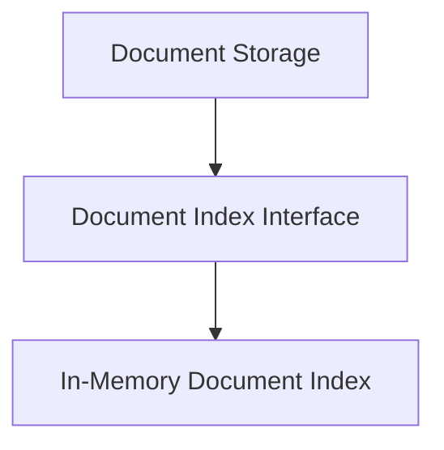

# Document Storage Module

The `document_storage` module provides a flexible and extensible framework for managing the storage, indexing, and retrieval of documents within the system. It defines a core interface for document indexing and offers an in-memory implementation for immediate use.

## Architecture

The `document_storage` module is structured around a central interface, `DocumentIndex`, which outlines the essential operations for any document indexing system. Concrete implementations, such as `InMemoryDocumentIndex`, adhere to this interface, ensuring consistency and interchangeability.

<!-- DIAGRAM_JSON
{
    "direction": "TD",
    "nodes": [
        {"id": "document_storage", "label": "Document Storage", "type": "module"},
        {"id": "document_index_interface", "label": "Document Index Interface", "type": "module", "link": "document_index_interface.md"},
        {"id": "in_memory_index_implementation", "label": "In-Memory Document Index", "type": "module", "link": "in_memory_index_implementation.md"}
    ],
    "edges": [
        {"source": "document_storage", "target": "document_index_interface"},
        {"source": "document_index_interface", "target": "in_memory_index_implementation"}
    ],
    "groups": []
}
-->

## Sub-modules

### [Document Index Interface](document_index_interface.md)
This sub-module defines the abstract `DocumentIndex` interface, which is the cornerstone for all document indexing operations. It specifies methods for `upserting` (adding or updating), `deleting`, and `getting` documents by their IDs, along with asynchronous counterparts. Any class that implements this interface must provide these core functionalities, ensuring a consistent API for document management regardless of the underlying storage mechanism.

### [In-Memory Document Index](in_memory_index_implementation.md)
This sub-module provides a concrete, in-memory implementation of the `DocumentIndex` interface. The `InMemoryDocumentIndex` stores documents in a Python dictionary and offers basic search capabilities by counting query occurrences within document content. It's suitable for lightweight indexing needs and serves as a clear example of how to implement the `DocumentIndex` interface.