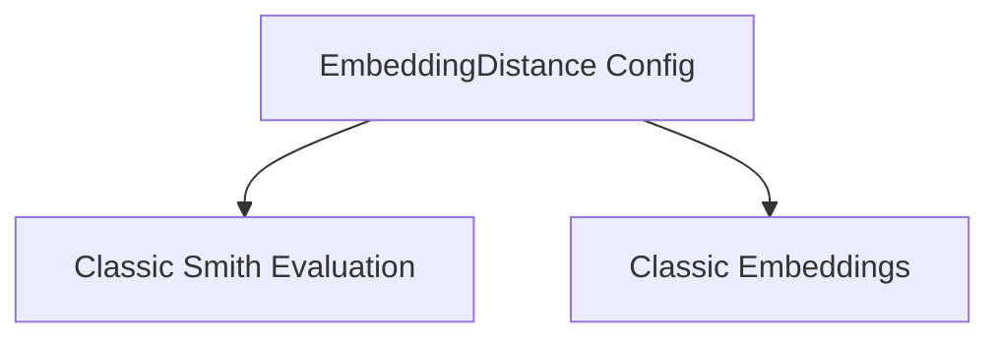

# Embedding Comparators Module

## Introduction

The `embedding_comparators` module is a specialized component within the `classic_smith_evaluation` suite, designed to facilitate the comparison of embeddings using various distance metrics. It primarily provides a configuration class for setting up embedding distance evaluators.

## Purpose and Core Functionality

This module's main purpose is to define the configuration required for evaluating the similarity or dissimilarity between different embeddings. It enables the system to use embedding-based metrics as part of a broader evaluation framework, particularly useful in tasks like semantic search, recommendation systems, or clustering validation where vector representations are key.

### `EmbeddingDistance` Component

The `EmbeddingDistance` class is the core of this module. It is a configuration object that specifies the `Embeddings` model to be used and the `distance_metric` for calculating the difference between embedding vectors.

*   **`embeddings`**: This attribute holds the actual embedding model or function that generates vector representations for data. This is typically an external dependency, often from the `classic_embeddings` module.
*   **`distance_metric`**: This specifies the algorithm used to measure the "distance" between two embedding vectors (e.g., cosine similarity, Euclidean distance). The specific enum `EmbeddingDistanceEnum` (likely defined in `classic_smith_evaluation`) dictates the available options.

## Architecture and Component Relationships

The `embedding_comparators` module is a leaf module within the evaluation configuration system. It primarily exposes the `EmbeddingDistance` configuration class, which relies on external modules for its underlying embedding generation and evaluation framework.

<!-- DIAGRAM_JSON
{
    "direction": "TD",
    "nodes": [
        {"id": "embedding_distance", "label": "EmbeddingDistance Config", "type": "component", "link": null},
        {"id": "classic_smith_evaluation", "label": "Classic Smith Evaluation", "type": "external", "link": "classic_smith_evaluation.md"},
        {"id": "classic_embeddings", "label": "Classic Embeddings", "type": "external", "link": "classic_embeddings.md"}
    ],
    "edges": [
        {"source": "embedding_distance", "target": "classic_smith_evaluation"},
        {"source": "embedding_distance", "target": "classic_embeddings"}
    ],
    "groups": []
}
-->

### Relationships:

*   `EmbeddingDistance` (`embedding_comparators`): This component defines the configuration for an embedding distance evaluator.
*   `Classic Smith Evaluation` ([`classic_smith_evaluation.md`](classic_smith_evaluation.md)): The `EmbeddingDistance` class inherits from `SingleKeyEvalConfig`, which is part of the broader evaluation configuration within `classic_smith_evaluation`. It also depends on `EvaluatorType` and `EmbeddingDistanceEnum` which are expected to be defined there.
*   `Classic Embeddings` ([`classic_embeddings.md`](classic_embeddings.md)): The `EmbeddingDistance` configuration requires an `Embeddings` object, which is provided by the `classic_embeddings` module.

## How it Fits into the Overall System

This module plays a crucial role in the LangChain evaluation ecosystem by providing a standardized way to configure embedding-based similarity metrics for various evaluation tasks. It allows developers to specify which embedding models and distance functions should be used when comparing outputs, ground truth, or other relevant data points in an evaluation run.

By centralizing the configuration of embedding comparisons, `embedding_comparators` ensures consistency and reusability across different evaluation scenarios within the LangChain `classic_smith_evaluation` framework. It abstracts away the details of how embeddings are generated and compared, allowing the evaluation system to focus on applying the configured metrics.