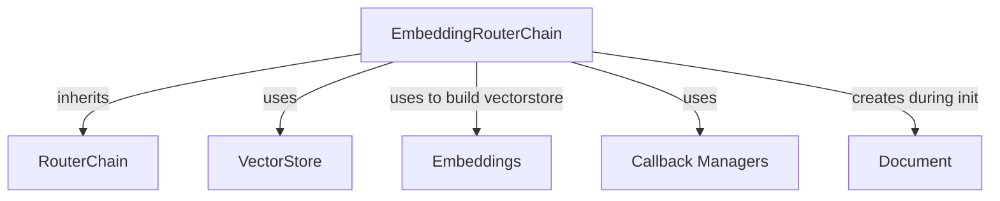

# `embedding_router` Module Documentation

The `embedding_router` module provides a specialized `RouterChain` implementation that leverages embeddings for intelligent routing decisions. It is designed to direct input queries to appropriate downstream chains or handlers based on the semantic similarity of the query to predefined descriptions of available options.

### `embedding_router.EmbeddingRouterChain`

The `EmbeddingRouterChain` is the core component of this module. It extends the `RouterChain` to enable routing based on vector similarity.

**Purpose and Core Functionality**

The primary function of `EmbeddingRouterChain` is to determine the most relevant "destination" for a given input by performing a similarity search against a `VectorStore`. Each potential destination is associated with one or more textual descriptions, which are embedded and stored in the vector store. When an input is received, its relevant parts (defined by `routing_keys`) are embedded, and a similarity search identifies the best matching destination.

**Key Features:**

*   **Embedding-based Routing:** Uses a `VectorStore` to find the semantically closest route.
*   **Flexible Input Keys:** Configurable `routing_keys` allow specifying which parts of the input dictionary should be used for the similarity search.
*   **Asynchronous Operations:** Supports both synchronous (`_call`) and asynchronous (`_acall`) routing.
*   **Convenience Constructors:** `from_names_and_descriptions` and `afrom_names_and_descriptions` provide an easy way to initialize the router chain by pairing destination names with their descriptions.

**Architecture and Component Relationships**

The `EmbeddingRouterChain` integrates several key components to achieve its functionality:

*   **`RouterChain` (Parent Class):** It inherits core routing logic and structure from `RouterChain`, ensuring compatibility within the routing chain framework (see [classic_chains_router.md](classic_chains_router.md)).
*   **`VectorStore`:** This is the central component for storing and querying document embeddings. The router uses the `VectorStore` to find the most similar destination description to the input query (see [core_vectorstores.md](core_vectorstores.md)).
*   **`Embeddings`:** Used during the initialization of the `VectorStore` (via `from_names_and_descriptions`) to convert textual descriptions into vector representations (see [classic_embeddings.md](classic_embeddings.md)).
*   **`Document`:** A fundamental data structure used to represent individual pieces of content that are stored in the `VectorStore`. In `EmbeddingRouterChain`, descriptions are converted into `Document` objects with destination names as metadata.
*   **Callback Managers:** `CallbackManagerForChainRun` and `AsyncCallbackManagerForChainRun` are used for managing callbacks during the execution of the chain, allowing for extensibility and monitoring (see [core_callbacks.md](core_callbacks.md)).

<!-- DIAGRAM_JSON
{
    "direction": "TD",
    "nodes": [
        {"id": "embedding_router_chain", "label": "EmbeddingRouterChain", "type": "component", "link": null},
        {"id": "router_chain_base", "label": "RouterChain", "type": "external", "link": "classic_chains_router.md"},
        {"id": "vectorstore_module", "label": "VectorStore", "type": "external", "link": "core_vectorstores.md"},
        {"id": "embeddings_module", "label": "Embeddings", "type": "external", "link": "classic_embeddings.md"},
        {"id": "callback_managers", "label": "Callback Managers", "type": "external", "link": "core_callbacks.md"},
        {"id": "document_type", "label": "Document", "type": "external", "link": null}
    ],
    "edges": [
        {"source": "embedding_router_chain", "target": "router_chain_base", "label": "inherits"},
        {"source": "embedding_router_chain", "target": "vectorstore_module", "label": "uses"},
        {"source": "embedding_router_chain", "target": "embeddings_module", "label": "uses to build vectorstore"},
        {"source": "embedding_router_chain", "target": "callback_managers", "label": "uses"},
        {"source": "embedding_router_chain", "target": "document_type", "label": "creates during init"}
    ],
    "groups": []
}
-->

**How the Module Fits into the Overall System**

The `embedding_router` module is a crucial part of the `classic_chains_router` package. It provides an intelligent, semantic routing mechanism for applications built with LangChain. By routing based on the meaning of the input rather than explicit keywords or rules, it enables more flexible and robust chain compositions. This module is particularly useful in scenarios where a system needs to dynamically select among multiple specialized downstream chains (e.g., different QA systems, agents, or tools) based on the user's intent expressed in their query. It serves as a foundational component for building complex, adaptable AI workflows.

The `EmbeddingRouterChain` allows developers to define a set of possible routes and their descriptions, and then relies on the power of embeddings to automatically pick the most suitable route, reducing the need for explicit rule-based routing logic and improving the system's ability to handle diverse and nuanced queries.