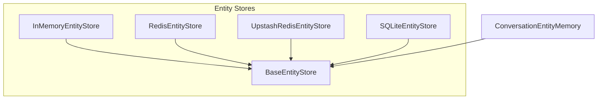

# entity_memories_and_stores
This module provides `ConversationEntityMemory` for extracting and summarizing entities from chat history, along with various `BaseEntityStore` implementations for persisting entity data.

<!-- DIAGRAM_JSON
{
  "nodes": [
    {"id": "A", "label": "ConversationEntityMemory"},
    {"id": "B", "label": "BaseEntityStore"},
    {"id": "C", "label": "InMemoryEntityStore"},
    {"id": "D", "label": "RedisEntityStore"},
    {"id": "E", "label": "UpstashRedisEntityStore"},
    {"id": "F", "label": "SQLiteEntityStore"}
  ],
  "edges": [
    {"source": "A", "target": "B", "label": "uses"},
    {"source": "C", "target": "B", "label": "inherits"},
    {"source": "D", "target": "B", "label": "inherits"},
    {"source": "E", "target": "B", "label": "inherits"},
    {"source": "F", "target": "B", "label": "inherits"}
  ],
  "groups": [
    {
      "id": "entity_stores",
      "label": "Entity Stores",
      "nodes": ["B", "C", "D", "E", "F"]
    }
  ]
}
-->
