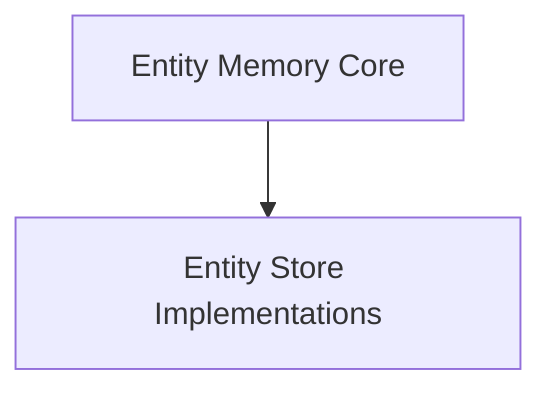

# Entity Memory Store Module

## Introduction
The `entity_memory_store` module provides robust capabilities for managing and persisting named entities within conversational memory. It allows for the extraction and summarization of entities from chat history, making it easier to maintain context and personalized interactions over time. This module supports various backend stores for entity persistence, offering flexibility in deployment.

## Architecture Overview
The `entity_memory_store` module is structured to separate the core entity memory logic from the underlying storage mechanisms. This design promotes modularity and allows for easy integration of different storage solutions.

<!-- DIAGRAM_JSON
{
    "direction": "TD",
    "nodes": [
        {"id": "entity_memory_core", "label": "Entity Memory Core", "type": "module", "link": "entity_memory_core.md"},
        {"id": "entity_stores", "label": "Entity Store Implementations", "type": "module", "link": "entity_stores.md"}
    ],
    "edges": [
        {"source": "entity_memory_core", "target": "entity_stores"}
    ],
    "groups": []
}
-->

## Sub-modules

### [Entity Memory Core](entity_memory_core.md)
This sub-module encapsulates the primary logic for `ConversationEntityMemory`. It handles the extraction of named entities from chat transcripts and generates summaries, which are then managed by an `entity_store`.

### [Entity Store Implementations](entity_stores.md)
This sub-module provides various implementations for storing and retrieving entity data. It includes `InMemoryEntityStore` for ephemeral storage, `RedisEntityStore` and `UpstashRedisEntityStore` for Redis-backed persistence, and `SQLiteEntityStore` for local database storage.
