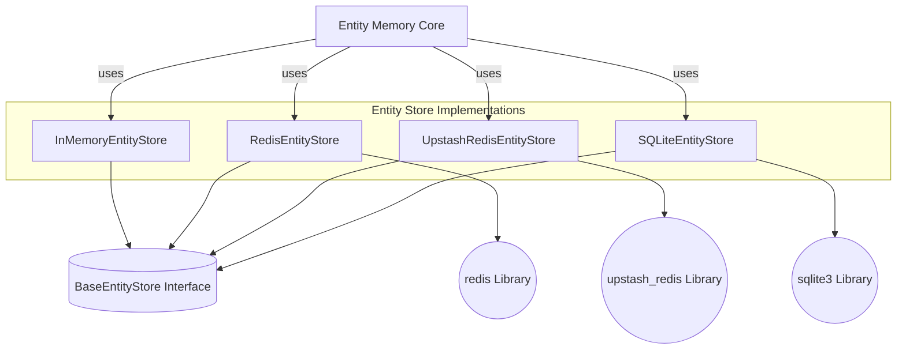

# entity_store_implementations

The `entity_store_implementations` module provides various concrete implementations for persistent and in-memory storage of entities, serving as the backbone for managing structured information within the LangChain Classic memory system. These implementations adhere to a common `BaseEntityStore` interface, allowing for flexible storage backends.

## Architecture and Component Relationships

The module offers a range of entity storage solutions, each tailored to different requirements concerning persistence, performance, and external dependencies.

<!-- DIAGRAM_JSON
{
    "direction": "TD",
    "nodes": [
        {"id": "in_memory_store", "label": "InMemoryEntityStore", "type": "component", "link": null},
        {"id": "redis_store", "label": "RedisEntityStore", "type": "component", "link": null},
        {"id": "upstash_redis_store", "label": "UpstashRedisEntityStore", "type": "component", "link": null},
        {"id": "sqlite_store", "label": "SQLiteEntityStore", "type": "component", "link": null},
        {"id": "base_entity_store", "label": "BaseEntityStore (Interface)", "type": "component", "link": null},
        {"id": "redis_lib", "label": "redis (External Library)", "type": "external", "link": null},
        {"id": "upstash_redis_lib", "label": "upstash_redis (External Library)", "type": "external", "link": null},
        {"id": "sqlite3_lib", "label": "sqlite3 (External Library)", "type": "external", "link": null},
        {"id": "entity_memory_core", "label": "Entity Memory Core", "type": "external", "link": "entity_memory_core.md"}
    ],
    "edges": [
        {"source": "in_memory_store", "target": "base_entity_store"},
        {"source": "redis_store", "target": "base_entity_store"},
        {"source": "upstash_redis_store", "target": "base_entity_store"},
        {"source": "sqlite_store", "target": "base_entity_store"},
        {"source": "redis_store", "target": "redis_lib"},
        {"source": "upstash_redis_store", "target": "upstash_redis_lib"},
        {"source": "sqlite_store", "target": "sqlite3_lib"},
        {"source": "entity_memory_core", "target": "in_memory_store"},
        {"source": "entity_memory_core", "target": "redis_store"},
        {"source": "entity_memory_core", "target": "upstash_redis_store"},
        {"source": "entity_memory_core", "target": "sqlite_store"}
    ],
    "groups": []
}
-->

## Purpose and Core Functionality

This module centralizes the implementations of various entity stores, each providing mechanisms to `get`, `set`, `delete`, `exists`, and `clear` entity data. These stores are fundamental for conversational AI systems that require remembering and recalling specific entities (e.g., user names, topics of discussion) across interactions.

The key implementations are:

*   **`InMemoryEntityStore`**: A basic, non-persistent store that keeps entities in a Python dictionary. Ideal for testing, short-lived sessions, or scenarios where persistence beyond the application's runtime is not required.
*   **`RedisEntityStore`**: Provides a persistent entity store backed by a Redis server. It includes Time-To-Live (TTL) functionality, allowing entities to expire automatically. The TTL can be extended upon recall, ensuring frequently accessed entities remain available. This is suitable for scalable, persistent memory in distributed environments.
*   **`UpstashRedisEntityStore`**: Similar to `RedisEntityStore` but specifically designed for integration with Upstash Redis, a serverless data platform. It offers comparable TTL and recall features, catering to cloud-native applications seeking a managed Redis solution.
*   **`SQLiteEntityStore`**: A file-based persistent store utilizing SQLite. It emphasizes secure query construction to prevent SQL injection vulnerabilities and is suitable for applications requiring local persistence without a separate database server.

## How the Module Fits into the Overall System

The `entity_store_implementations` module is a crucial sub-module of `classic_memory.entity_memory_store`. It provides the concrete storage mechanisms that the higher-level [entity_memory_core](entity_memory_core.md) module utilizes to manage and interact with entities.

By abstracting the storage layer through the `BaseEntityStore` interface, this module allows `entity_memory_core` and other memory components to be agnostic to the underlying storage technology. This promotes modularity and allows developers to easily swap between different entity store implementations (e.g., from `InMemoryEntityStore` for development to `RedisEntityStore` for production) without altering the core memory logic.

These entity stores contribute directly to the "classic" memory types in LangChain, enabling agents and chains to maintain a stateful understanding of ongoing conversations and user-specific data.
