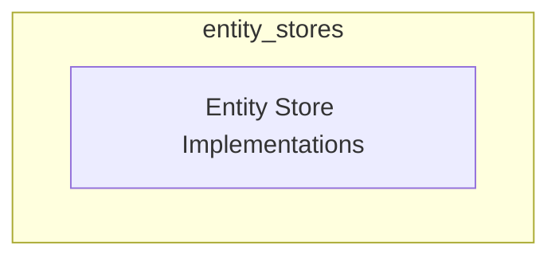

# entity_stores Module Documentation

## Introduction

The `entity_stores` module provides a flexible framework for managing the storage and retrieval of entities within the system. It offers various backend implementations, allowing developers to choose the most suitable storage solution based on their application's requirements, such as performance, persistence, and scalability.

## Architecture

The module is designed with a clear separation of concerns, providing a common interface for entity storage while abstracting the underlying storage mechanism. This allows for easy interchangeability of different storage backends.

<!-- DIAGRAM_JSON
{
    "direction": "TD",
    "nodes": [
        {"id": "entity_store_implementations", "label": "Entity Store Implementations", "type": "module", "link": "entity_store_implementations.md"}
    ],
    "edges": [],
    "groups": []
}
-->

## Sub-modules

### [Entity Store Implementations](entity_store_implementations.md)
This sub-module encapsulates the different concrete implementations for storing entities. It includes solutions like in-memory storage for quick testing, and persistent options like Redis, Upstash Redis, and SQLite for production environments. Each implementation adheres to a common interface, ensuring consistent interaction regardless of the chosen backend.