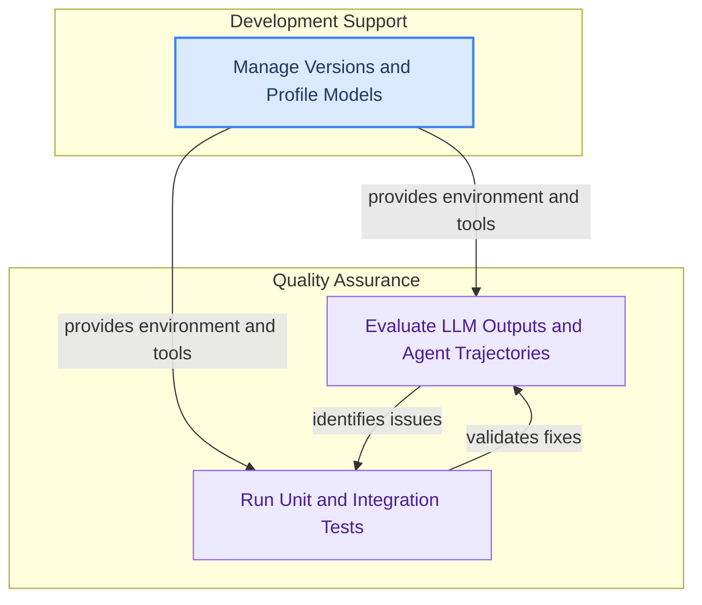

The `evaluation_and_testing` module provides a comprehensive suite of tools for assessing the performance and correctness of language model applications and agents. It includes frameworks for evaluating model outputs, agent trajectories, and various testing utilities, alongside developer tools for version management and model profiling. This module empowers developers to build robust and reliable AI applications by offering systematic ways to measure quality, identify regressions, and streamline the development workflow.

### Module Architecture

The `evaluation_and_testing` module is structured into three main functional areas:

### Core Components

*   **Evaluation Framework**: Provides a comprehensive framework for evaluating language model outputs and agent trajectories, including various concrete evaluator implementations and tools for running evaluations on datasets.
    *   [evaluation_framework.md](evaluation_framework.md)
*   **Testing Utilities**: Offers a collection of base classes and fixtures for unit and integration testing of various LangChain components, ensuring their correct functionality and performance.
    *   [testing_utilities.md](testing_utilities.md)
*   **Developer Tools**: Offers essential utilities for developers, including tools for validating package version consistency, a laboratory for experimenting with and comparing different language models, and a robust system for managing module imports with deprecation handling.
    *   [developer_tools.md](developer_tools.md)