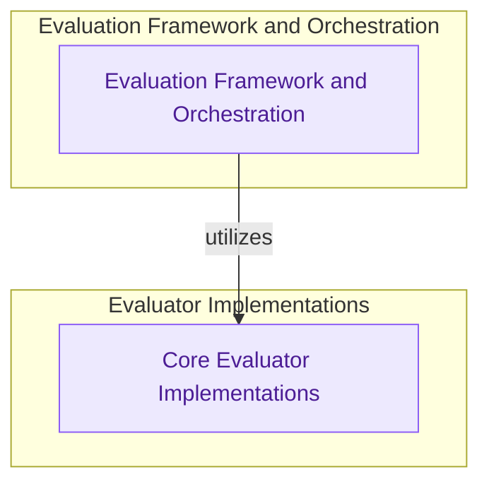

# Evaluation Framework
This module provides a comprehensive framework for evaluating language model outputs and agent trajectories, including various concrete evaluator implementations and tools for running evaluations on datasets.

<!-- DIAGRAM_JSON
{
    "direction": "TD",
    "nodes": [
        {
            "id": "core_evaluators",
            "label": "Core Evaluator Implementations",
            "type": "module",
            "link": "core_evaluators.md"
        },
        {
            "id": "evaluation_framework_orchestration",
            "label": "Evaluation Framework & Orchestration",
            "type": "module",
            "link": "evaluation_framework_orchestration.md"
        }
    ],
    "edges": [
        {
            "source": "evaluation_framework_orchestration",
            "target": "core_evaluators",
            "label": "utilizes"
        }
    ],
    "groups": [
        {
            "id": "eval_impl",
            "label": "Evaluator Implementations",
            "role": "analytical",
            "nodes": [
                "core_evaluators"
            ]
        },
        {
            "id": "eval_orch",
            "label": "Framework and Orchestration",
            "role": "analytical",
            "nodes": [
                "evaluation_framework_orchestration"
            ]
        }
    ]
}
-->
