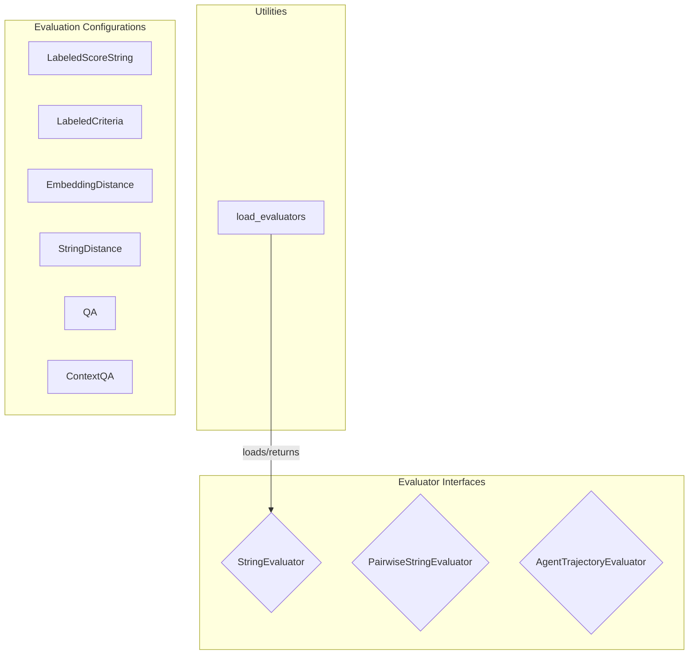

# evaluation_framework_orchestration
This module defines the core interfaces for different types of evaluators, including string, pairwise string, and agent trajectory evaluation. It also provides configuration classes for various evaluation methods like QA, criteria, and distance metrics, along with a utility for loading evaluators.

<!-- DIAGRAM_JSON
{
  "nodes": [
    {"id": "A", "label": "load_evaluators", "type": "function"},
    {"id": "B", "label": "StringEvaluator", "type": "class"},
    {"id": "C", "label": "PairwiseStringEvaluator", "type": "class"},
    {"id": "D", "label": "AgentTrajectoryEvaluator", "type": "class"},
    {"id": "E", "label": "LabeledScoreString", "type": "class"},
    {"id": "F", "label": "LabeledCriteria", "type": "class"},
    {"id": "G", "label": "EmbeddingDistance", "type": "class"},
    {"id": "H", "label": "StringDistance", "type": "class"},
    {"id": "I", "label": "QA", "type": "class"},
    {"id": "J", "label": "ContextQA", "type": "class"}
  ],
  "edges": [
    {"source": "A", "target": "B", "label": "loads/returns"}
  ],
  "groups": [
    {"id": "evaluator_interfaces", "label": "Evaluator Interfaces", "nodes": ["B", "C", "D"]},
    {"id": "evaluation_configurations", "label": "Evaluation Configurations", "nodes": ["E", "F", "G", "H", "I", "J"]},
    {"id": "utilities", "label": "Utilities", "nodes": ["A"]}
  ]
}
-->
