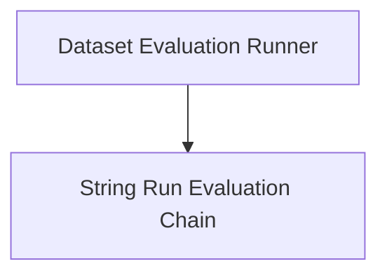

# evaluation_runner Module Documentation

## Introduction

The `evaluation_runner` module, found within `classic_smith_evaluation`, is a crucial component for systematically evaluating language models and chains against specified datasets. It provides the necessary utilities for executing evaluation runs, collecting performance metrics, and integrating with various evaluation criteria to track the effectiveness and quality of AI systems within the LangSmith ecosystem.

## Architecture Overview

The module is primarily composed of two key functional areas: the dataset evaluation runner, which orchestrates the execution of evaluations over datasets, and the string run evaluation chain, which defines a flexible mechanism for performing string-based evaluations.

<!-- DIAGRAM_JSON
{
    "direction": "TD",
    "nodes": [
        {"id": "dataset_runner", "label": "Dataset Evaluation Runner", "type": "module", "link": "dataset_runner.md"},
        {"id": "string_evaluation_chain", "label": "String Run Evaluation Chain", "type": "module", "link": "string_evaluation_chain.md"}
    ],
    "edges": [
        {"source": "dataset_runner", "target": "string_evaluation_chain"}
    ],
    "groups": []
}
-->

## Sub-modules

### Dataset Evaluation Runner
This sub-module is responsible for preparing, executing, and finalizing evaluation runs across datasets. It handles both synchronous (`run_on_dataset`) and asynchronous (`arun_on_dataset`) evaluation processes, manages evaluation state via `_DatasetRunContainer`, and integrates with callback handlers to collect metrics and feedback. For more details, refer to the [Dataset Evaluation Runner documentation](dataset_runner.md).

### String Run Evaluation Chain
This sub-module provides the `StringRunEvaluatorChain`, a specialized chain for evaluating model runs based on string inputs and predictions. It enables the integration of custom `StringEvaluator` instances to assess various aspects of model output, such as correctness or helpfulness, by mapping run and example data into a format suitable for string-based evaluation. For more details, refer to the [String Run Evaluation Chain documentation](string_evaluation_chain.md).